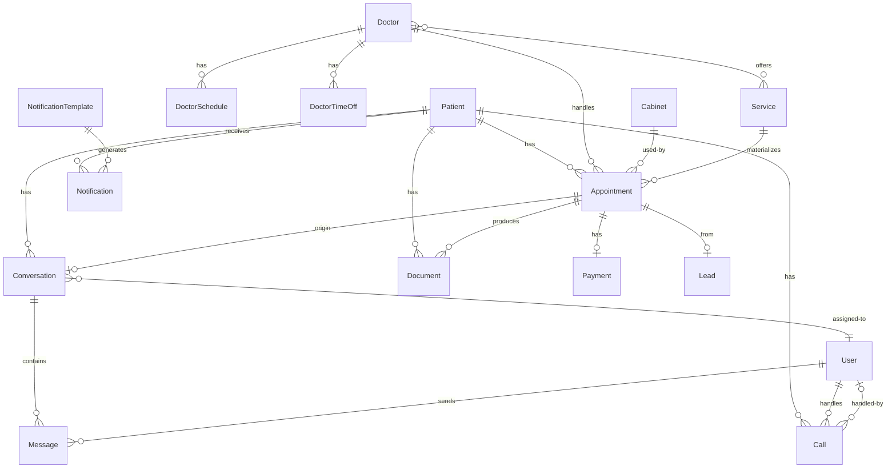

# Neurofax CRM — Техническое задание

> Документ описывает **полную систему управления клиникой** по макетам (папка `/Users/joe/Desktop/medbook/` — файлы `1 - Ресепшн.png` … `Telegram Web App.png`).
> **Статус:** v2, решения по открытым вопросам приняты, цель — **production-версия "как на скринах"** (не MVP).
> **Ключевые решения:** ru/uz; UZS + USD; **мультитенантная архитектура** (несколько клиник на одной инсталляции); текущий код (`/dashboard`, `/doctor`, `/receptionist`) сносим полностью; SMS/телефония/платежи — адаптеры-заглушки до выбора провайдеров; TG бот создаём новый; мед-интеграция не нужна.
> **Дата:** 2026-04-22

---

## Оглавление

1. [Обзор продукта](#1-обзор-продукта)
2. [Роли и права](#2-роли-и-права)
3. [Навигация и роутинг](#3-навигация-и-роутинг)
4. [Дизайн-система](#4-дизайн-система)
5. [Модель данных](#5-модель-данных)
6. [Экраны — детально](#6-экраны--детально)
    - 6.1 [Ресепшн](#61-ресепшн)
    - 6.2 [Записи](#62-записи)
    - 6.3 [Календарь](#63-календарь)
    - 6.4 [Пациенты (список)](#64-пациенты-список)
    - 6.5 [Карточка пациента](#65-карточка-пациента)
    - 6.6 [Врачи](#66-врачи)
    - 6.7 [Call Center](#67-call-center)
    - 6.8 [Telegram inbox](#68-telegram-inbox)
    - 6.9 [Уведомления](#69-уведомления)
    - 6.10 [TG Bot + Mini App](#610-tg-bot--mini-app)
7. [Сквозные связи и флоу](#7-сквозные-связи-и-флоу)
8. [Интеграции и инфраструктура](#8-интеграции-и-инфраструктура)
9. [Нефункциональные требования](#9-нефункциональные-требования)
10. [План реализации по фазам](#10-план-реализации-по-фазам)
11. [Зачистка текущего кода](#11-зачистка-текущего-кода)
12. [Принятые решения](#12-принятые-решения)
13. [Команда агентов проекта](#13-команда-агентов-проекта)

---

## 1. Обзор продукта

**Neurofax CRM** — операционная система клиники. В одной системе живут пять рабочих мест:

| Рабочее место | Роль | Где работает |
|---|---|---|
| **Рецепция** | записывает, встречает, принимает оплаты, запускает очередь | `/crm/reception` + киоск/ТВ как «глаза» |
| **Call-центр** | обрабатывает входящие звонки, обзвон пропусков, холодная продажа | `/crm/call-center` |
| **Оператор коммуникаций** | ведёт диалоги в Telegram/SMS, реагирует на заявки | `/crm/telegram`, `/crm/sms` |
| **Администратор / директор** | аналитика, настройки, управление сотрудниками | `/crm/analytics`, `/crm/settings` |
| **Врач** | видит свою очередь, заполняет результаты приёмов | `/crm/doctor` |

**Клиент** (пациент) взаимодействует через три поверхности:
- **Сайт neurofax.uz** — лендинг + форма заявки (уже есть)
- **Киоск в клинике** — чек-ин по телефону, печать талона (уже есть)
- **Telegram Mini App + Bot** — запись, напоминания, переписка (новое)

Ключевой принцип: **каждый пациент, который контактирует с клиникой (звонок, TG, заявка на сайте, walk-in), превращается в запись в CRM**, к которой привязывается вся последующая история коммуникаций, визитов, платежей.

---

## 2. Роли и права

### 2.1 Роли

```prisma
enum Role {
  ADMIN           // директор, полный доступ
  RECEPTIONIST    // рецепция в клинике
  CALL_OPERATOR   // call-центр (может сидеть удалённо)
  DOCTOR          // врач
  NURSE           // медсестра (опционально, если нужно разграничивать)
}
```

### 2.2 Матрица прав

Обозначения: `R` — read, `W` — write/create, `U` — update, `D` — delete, `—` — нет доступа, `own` — только свои данные, `ltd` — ограниченный скоуп.

| Раздел / Действие | ADMIN | RECEPTIONIST | CALL_OPERATOR | DOCTOR | NURSE |
|---|---|---|---|---|---|
| Ресепшн дашборд | RWUD | RWU | R (ltd) | own | R |
| Записи — просмотр | R all | R all | R all | R own | R today |
| Записи — создать | W | W | W | — | — |
| Записи — изменить статус | U | U | U | U own | U (WAITING→IN_PROGRESS) |
| Записи — удалить | D | D | — | — | — |
| Календарь | RWUD | RWU | RWU | R own | R |
| Пациенты — список | R | R | R | R | R |
| Пациенты — карточка | RWUD | RWU | RU (no medical) | R + write medical | R (no medical) |
| Пациенты — удалить | D | — | — | — | — |
| Пациенты — экспорт CSV | ✓ | ✓ | — | — | — |
| Врачи (аналитика) | R all | R (ltd) | — | R own | — |
| Врачи — редактировать | U | — | — | own profile | — |
| Call Center — диалоги | R all | R | RWUD | — | — |
| Call Center — звонки | R all | R | RWUD | — | — |
| Telegram inbox | R all + assign | RWU | RWU | — | — |
| SMS | R all | RW | RW | — | — |
| Уведомления — шаблоны | RWUD | R | R | R | — |
| Уведомления — отправить | W | W | W | — | — |
| Уведомления — очередь | R | R ltd | R ltd | own | — |
| Платежи | RWUD | RWU | R (ltd) | R own | — |
| Документы пациента | RWUD | RWU | R | R + W | R |
| Настройки системы | RWUD | — | — | — | — |
| Пользователи и роли | RWUD | — | — | — | — |
| Аудит-лог | R | — | — | — | — |
| Экспорт CSV | ✓ | ✓ | — | — | — |

### 2.3 Доступ пациента

Пациент не имеет аккаунта в CRM. Он взаимодействует через:
- **TG Mini App** — авторизация через TG Login Widget, видит только свои данные
- **Публичный талон** `/ticket/[id]` — read-only, по токену в URL
- **Публичная очередь** `/q` — анонимная агрегированная
- **Сайт neurofax.uz** — публичные страницы + лид-форма

### 2.4 Терминальный PIN

Как уже реализовано: ТВ и киоск авторизуются коротким PIN’ом + IP-allowlist. Действия терминалов пишутся в `AuditLog` как `actorRole: "TERMINAL"`.

---

## 3. Навигация и роутинг

### 3.1 Структура сайта

```
neurofax.uz/
├── (public)                        # публичная часть
│   ├── /                           # лендинг (есть)
│   ├── /services/[slug]            # услуги
│   ├── /doctors/[slug]             # врачи
│   └── /ticket/[id]                # талон пациента
│
├── (patient)                       # пациентская часть (TG Auth)
│   ├── /q                          # публичная очередь (анонимно)
│   └── /my                         # TG Mini App (история записей, новая запись)
│
├── (crm)                           # рабочее место персонала
│   ├── /login
│   ├── /crm
│   │   ├── /reception              ⭐ новый дашборд рецепции
│   │   ├── /appointments           ⭐ список записей
│   │   ├── /calendar               ⭐ календарь
│   │   ├── /patients               ⭐ список пациентов
│   │   ├── /patients/[id]          ⭐ карточка пациента
│   │   ├── /doctors                ⭐ аналитика врачей
│   │   ├── /doctors/[id]
│   │   ├── /cabinets               кабинеты
│   │   ├── /call-center            ⭐ call-центр
│   │   ├── /telegram               ⭐ Telegram inbox
│   │   ├── /telegram/[conversationId]
│   │   ├── /sms                    SMS inbox
│   │   ├── /notifications          ⭐ центр уведомлений
│   │   ├── /notifications/templates
│   │   ├── /analytics              аналитика (агрегат)
│   │   ├── /documents              библиотека документов
│   │   ├── /settings               настройки клиники
│   │   └── /settings/users         пользователи и роли
│   │
│   └── /doctor                     рабочее место врача
│       ├── /queue                  очередь на сегодня
│       └── /patient/[id]           карточка пациента (медицинская)
│
├── (terminals)                     # терминалы
│   ├── /kiosk                      киоск чек-ина
│   ├── /tv                         ТВ в зале ожидания
│   └── /receptionist/queue         режим рецепции на планшете
│
└── /api                            REST API + webhooks
```

⭐ — экраны из новых макетов. Остальное — уже существующее или расширение.

### 3.2 Сайдбар CRM

Левый сайдбар 200-240 px, шапка с логотипом «Neurofax — медиа клиник», группы:

**Группа 1 — Операции**
- Ресепшн
- Записи
- Календарь
- Пациенты
- Врачи
- Кабинеты

**Группа 2 — Коммуникации**
- Call Center
- Telegram
- SMS
- Уведомления

**Группа 3 — Управление**
- Аналитика
- Документы
- Настройки

**Нижний блок** (виджет): круговая диаграмма «Загруженность клиники сегодня 63%» — кликабельна, ведёт на Аналитику.

### 3.3 Топбар

Структура слева направо:
1. Название текущей страницы + подзаголовок (например «Главный дашборд»)
2. Глобальный поиск — по ФИО / телефону / ID записи (живой, с результатами-дропдауном)
3. CTA-кнопка «+ Новая запись» (primary, всегда доступна кроме экрана записи)
4. Часы (текущее время, например 18:47)
5. Иконка непрочитанных сообщений (TG+SMS, с бейджем)
6. Колокольчик уведомлений (системные алерты)
7. Аватар текущего пользователя → дропдаун (Профиль, Язык ru/uz, Выйти)

### 3.4 Правая панель (right rail)

На многих экранах справа узкая колонка 320-360 px с:
- Контекстными «Быстрыми действиями»
- Связанными виджетами (свободные слоты, статистика, превью)

Панель сворачивается кнопкой.

---

## 4. Дизайн-система

### 4.1 Цветовые токены

Palette извлечена из макетов визуально (при наличии Figma сверить точные HEX-коды).

| Токен | HEX (прибл.) | Где |
|---|---|---|
| `brand/primary` | `#3DD5C0` | кнопки, акценты, бренд |
| `brand/primary-hover` | `#2FC3AE` | hover состояние |
| `brand/primary-soft` | `#E8FAF6` | бекграунды активных пунктов меню |
| `accent/pink` | `#FF7BA1` | розовые бейджи (VIP, женщины) |
| `accent/orange` | `#FFB547` | ожидание, предупреждения |
| `accent/yellow` | `#FFD560` | KPI «Ждут приёма» |
| `accent/violet` | `#8D7DF8` | VIP сегмент, TG-канал |
| `accent/blue` | `#4FA3FF` | на приёме, системные ссылки |
| `accent/green` | `#3BD671` | успех, завершено, оплачено |
| `accent/red` | `#FF5C5C` | отменено, ошибки |
| `neutral/bg-page` | `#F5F7FA` | фон страницы |
| `neutral/bg-card` | `#FFFFFF` | карточки |
| `neutral/border` | `#E5E9F0` | разделители, бордеры |
| `neutral/text-primary` | `#1A2333` | основной текст |
| `neutral/text-secondary` | `#6B7589` | вторичный текст |
| `neutral/text-muted` | `#9BA4B5` | плейсхолдеры |

**Статусные цвета записей** (для бейджей, строк таблиц, точек на календаре):

| Статус | Цвет | Фон-пилюли |
|---|---|---|
| `NEW` (лид, не подтверждён) | `#8D7DF8` violet | `#ECE9FE` |
| `WAITING` (ожидает) | `#FFB547` orange | `#FFF4E0` |
| `CONFIRMED` (подтверждён) | `#4FA3FF` blue | `#E5F1FF` |
| `IN_PROGRESS` (на приёме) | `#3DD5C0` teal | `#E0F7F2` |
| `COMPLETED` (завершён) | `#3BD671` green | `#E0F7E8` |
| `NO_SHOW` (не пришёл) | `#9BA4B5` gray | `#ECEEF2` |
| `CANCELLED` (отменён) | `#FF5C5C` red | `#FFE3E3` |
| `RESCHEDULED` (перенесён) | `#FFD560` yellow | `#FFF8D6` |

### 4.2 Типографика

```
font-family: 'Inter', system-ui, sans-serif

Dashboard title:      22/28  semibold   #1A2333
Section header:       16/24  semibold
KPI number:           28/32  bold
KPI label:            12/16  medium     #6B7589  uppercase tracking
Body:                 14/20  regular
Caption:              12/16  regular    #6B7589
Table row:            13/18
Button:               14/20  medium
```

### 4.3 Спейсинг и радиусы

```
Radii:     sm=6, md=10, lg=14, xl=18, full=9999
Shadows:   card   = 0 1px 2px rgba(15,23,42,.04), 0 2px 6px rgba(15,23,42,.04)
           raised = 0 8px 24px rgba(15,23,42,.08)
Spacing:   4-pt base grid (4/8/12/16/20/24/32/40/48/64)
```

### 4.4 Атомы (переиспользуемые компоненты)

Обязательный набор — собираем в Фазе 0.

| Компонент | Описание | Пропсы (ключевые) |
|---|---|---|
| `<Avatar>` | аватар + статус-точка + fallback инициалы | `src, name, size, status` |
| `<Badge>` | статусная пилюля | `tone, label, icon?` |
| `<Chip>` | кликабельный фильтр-чип | `selected, count?, onRemove?` |
| `<Tag>` | ярлычок на сегмент/источник | `color, label` |
| `<StatCard>` | KPI карточка | `icon, label, value, delta, trend, bgTone?` |
| `<MetricPill>` | узкая KPI-пилюля в хедере | `label, value, tone` |
| `<SectionHeader>` | заголовок секции + actions | `title, actions?, meta?` |
| `<FilterBar>` | строка фильтров | `filters[], onChange` |
| `<SearchInput>` | инпут-поиск с автодополнением | `results, onSelect` |
| `<DataTable>` | сортируемая/пагинируемая таблица | `columns, rows, selection?, onRowClick?` |
| `<PatientRow>` | строка с пациентом (avatar + имя + метаданные) | `patient, meta?` |
| `<DoctorCard>` | карточка врача | `doctor, stats?, schedule?` |
| `<AppointmentCard>` | карточка записи в очереди/календаре | `appointment, compact?` |
| `<TimeSlot>` | прямоугольный слот времени | `time, status` |
| `<WeekGrid>` | календарная сетка по врачам | `doctors, appointments, onDrop` |
| `<ChatMessage>` | пузырь сообщения (in/out/buttons) | `message, direction` |
| `<ChatList>` | список превью чатов | `conversations, activeId` |
| `<QuickActionTile>` | плитка быстрого действия в правой панели | `icon, title, subtitle?, onClick` |
| `<FreeSlotsList>` | свободные слоты на сегодня | `slots[], onPick` |
| `<NotificationItem>` | строка уведомления | `notification, patient` |
| `<TemplateTree>` | дерево шаблонов уведомлений | `tree, selectedId, onSelect` |
| `<DonutGauge>` | круговая диаграмма в сайдбаре | `percent, label` |
| `<EmptyState>` | заглушка при пустом состоянии | `icon, title, cta?` |
| `<Sheet>` / `<Drawer>` | боковая панель | `side, open` |
| `<Dialog>` | модалка | `open, title, footer` |
| `<DatePicker>` `<TimePicker>` | выбор даты/времени | стандарт |
| `<SegmentTabs>` | переключатель вкладок | `tabs, value` |
| `<Stepper>` | вертикальный степпер (история визита) | `steps[]` |

### 4.5 Рекомендуемый стек UI

- **Tailwind CSS** для стилей (уже в проекте) + кастомный тема-пресет с токенами выше
- **shadcn/ui** как база компонентов (Button, Dialog, DropdownMenu, Command, Select, Toast, Sheet)
- **TanStack Table v8** для всех таблиц (список записей, пациентов, платежей)
- **FullCalendar** или **react-big-calendar** для `/calendar` (поддержка DnD из коробки)
- **Recharts** или **Tremor** для графиков (KPI, аналитика, загрузка по часам)
- **TanStack Query v5** для data-fetching + кэш + optimistic updates
- **Base UI** оставляем точечно, где уже работает (Select, Dialog из текущего кода)
- **lucide-react** иконки (уже в проекте)

### 4.6 Real-time слой

Экраны `/reception`, `/telegram`, `/call-center`, `/tv` — живые. Нужен реал-тайм. Варианты:

1. **SSE (Server-Sent Events)** — простой, работает через HTTP, подходит для push-only
2. **WebSocket через Socket.IO** — двусторонний, нужен Redis adapter при горизонтальном масштабе
3. **Polling через TanStack Query** `refetchInterval: 5s` — самый простой фолбек

**Рекомендация:** на MVP — polling 3-5 сек для всех живых экранов, замена на SSE в Фазе 3.

---

## 5. Модель данных

Полная схема Prisma. **Жирным** выделены новые сущности и поля относительно текущей схемы.

> 🏥 **Мультитенантная архитектура.** Система обслуживает **несколько клиник** на одной инсталляции. Каждая операционная сущность (Patient, Doctor, Appointment, Cabinet, Service, Call, Conversation, Notification, Template, Document и т.д.) содержит `clinicId String` + `clinic Clinic @relation(...)`. Изоляция на уровне API + БД (каждый запрос автоматически фильтруется по `session.user.clinicId`, см. §5.5). Ниже `clinicId` указан явно только в ключевых моделях — в остальных подразумевается, что он присутствует с соответствующим составным индексом `@@index([clinicId, ...])`.

### 5.1 Существующие сущности (с расширением)

```prisma
model User {
  id         String   @id @default(cuid())
  email      String   @unique
  passwordHash String
  role       Role
  name       String
  **photoUrl  String?**
  **phone     String?**
  **telegramId String?**        // для личных уведомлений сотруднику
  doctor     Doctor?
  createdAt  DateTime @default(now())
  updatedAt  DateTime @updatedAt

  // relations
  auditLogs      AuditLog[]
  assignedConvs  Conversation[]   @relation("ConversationAssignee")
  calls          Call[]           @relation("CallOperator")
  sentMessages   Message[]        @relation("MessageSender")
}

model Doctor {
  id             String   @id @default(cuid())
  userId         String?  @unique
  user           User?    @relation(fields: [userId], references: [id])
  nameRu         String
  nameUz         String
  specializationRu String
  specializationUz String
  **photoUrl       String?**
  **bioRu          String?**
  **bioUz          String?**
  **rating         Decimal? @db.Decimal(3,2)**    // 4.87
  **reviewCount    Int       @default(0)**
  **color          String    @default("#3DD5C0")** // цвет в календаре
  **pricePerVisit  Int?**
  **salaryPercent  Int      @default(40)**       // % от выручки
  **slug           String   @unique**
  **isActive       Boolean  @default(true)**

  services       ServiceOnDoctor[]
  schedules      DoctorSchedule[]     // рабочие часы
  appointments   Appointment[]
  leads          Lead[]
  createdAt  DateTime @default(now())
  updatedAt  DateTime @updatedAt
}

model Patient {
  id           String   @id @default(cuid())
  fullName     String
  phone        String   @unique
  **phoneNormalized String @unique**       // E.164
  **birthDate    DateTime?**
  **gender       Gender?**
  **passport     String?**
  **address      String?**
  **photoUrl     String?**
  **telegramId   String?  @unique**        // chat_id после Login Widget
  **telegramUsername String?**
  **preferredChannel Channel @default(TELEGRAM)**
  **preferredLang    Lang    @default(RU)**
  **source       LeadSource?**            // откуда пришёл первый раз
  **segment      PatientSegment @default(NEW)**
  **tags         String[]**              // массив произвольных тегов
  **notes        String?**              // короткая заметка рецепции
  **ltv          Int      @default(0)**  // сумма всех оплат
  **visitsCount  Int      @default(0)**  // денормализация для списка
  **balance      Int      @default(0)**  // долг (отрицат.) или предоплата
  **discountPct  Int      @default(0)**  // % скидки по умолчанию
  **lastVisitAt  DateTime?**
  **nextVisitAt  DateTime?**
  **consentMarketing Boolean @default(false)**  // согласие на рассылки
  **clinicId     String**                         // multi-tenant: к какой клинике привязан
  **clinic       Clinic   @relation(fields: [clinicId], references: [id])**
  createdAt    DateTime @default(now())
  updatedAt    DateTime @updatedAt

  appointments  Appointment[]
  payments      Payment[]          @relation(name: "PatientPayments")   // через Appointment
  conversations Conversation[]
  calls         Call[]
  notifications Notification[]
  documents     Document[]

  @@unique([clinicId, phoneNormalized])
  @@index([clinicId, fullName])
  @@index([clinicId, segment])
  @@index([clinicId, lastVisitAt])
}

enum Gender { MALE FEMALE }
enum Lang   { RU UZ }
enum Channel { TELEGRAM SMS CALL WEB WALKIN }
enum LeadSource { WEBSITE TELEGRAM INSTAGRAM CALL WALKIN REFERRAL ADS OTHER }
enum PatientSegment { NEW REGULAR VIP LOST }

model Appointment {
  id             String   @id @default(cuid())
  **clinicId       String**
  **clinic         Clinic   @relation(fields: [clinicId], references: [id])**
  patientId      String
  patient        Patient  @relation(fields: [patientId], references: [id])
  doctorId       String
  doctor         Doctor   @relation(fields: [doctorId], references: [id])
  **cabinetId      String?**
  **cabinet        Cabinet? @relation(fields: [cabinetId], references: [id])**
  **serviceId      String?**
  **service        Service? @relation(fields: [serviceId], references: [id])**

  service        String?                    // legacy свободная строка услуги (сохранить для миграции)
  date           DateTime                   // плановое начало приёма
  **durationMin    Int      @default(30)**
  **endDate        DateTime**                 // date + durationMin, денормализация для календаря

  queueStatus    AppointmentStatus
  queueOrder     Int?
  calledAt       DateTime?                  // когда вызвали на ТВ
  **startedAt      DateTime?**               // фактическое начало приёма
  **completedAt    DateTime?**               // фактическое завершение
  **cancelledAt    DateTime?**
  **cancelReason   String?**

  source         AppointmentSource @default(WALKIN)
  leadId         String?  @unique
  lead           Lead?    @relation(fields: [leadId], references: [id])

  **priceBase      Int?**                    // цена услуги на момент создания
  **discountPct    Int      @default(0)**
  **discountAmount Int      @default(0)**
  **priceFinal     Int?**                    // итоговая сумма к оплате

  **createdBy      String?**                 // userId оператора
  **notes          String?**                 // внутренняя заметка рецепции

  payment        Payment?
  conversation   Conversation?              // если запись пришла из диалога
  documents      Document[]

  createdAt      DateTime @default(now())
  updatedAt      DateTime @updatedAt

  @@index([clinicId, date, doctorId])
  @@index([clinicId, queueStatus])
  @@index([clinicId, patientId, date])
  @@index([clinicId, endDate, cabinetId])
}

enum AppointmentStatus {
  NEW          // создан из лида, не подтверждён
  WAITING      // в очереди в клинике
  CONFIRMED    // подтверждён (будущая запись)
  IN_PROGRESS  // на приёме
  COMPLETED    // завершён
  NO_SHOW      // не пришёл
  CANCELLED    // отменён
  RESCHEDULED  // перенесён
}

enum AppointmentSource {
  WALKIN        // пришёл с улицы
  WEB           // форма на сайте
  TELEGRAM_BOT  // бот
  TELEGRAM_APP  // Mini App
  CALL_IN       // входящий звонок
  CALL_OUT      // наш обзвон
  REFERRAL      // по рекомендации другого врача
}

model Payment {
  id             String   @id @default(cuid())
  appointmentId  String   @unique
  appointment    Appointment @relation(fields: [appointmentId], references: [id])
  **currency       Currency @default(UZS)**       // UZS или USD
  amount         Int                             // в минимальных единицах валюты
  **amountUsdSnap  Int?**                         // конверсия в USD на момент платежа (для отчётов)
  **fxRate         Decimal? @db.Decimal(12,4)**   // курс UZS→USD использованный
  method         PaymentMethod
  status         PaymentStatus
  **receiptNumber  String?**
  **receiptUrl     String?**                // PDF чек (не фискальный, фискализация вне scope)
  **refundedAmount Int     @default(0)**
  **paidAt         DateTime?**
  createdAt      DateTime @default(now())
  updatedAt      DateTime @updatedAt
}

enum PaymentMethod { CASH CARD TRANSFER PAYME CLICK UZUM OTHER }
enum PaymentStatus { UNPAID PARTIAL PAID REFUNDED }

model Lead {
  // как есть, плюс связи
  id          String   @id @default(cuid())
  name        String
  phone       String
  service     String
  date        DateTime?
  doctorId    String?
  doctor      Doctor?  @relation(fields: [doctorId], references: [id])
  status      LeadStatus
  **source      LeadSource @default(WEBSITE)**
  **utm         Json?**                      // utm_source, utm_medium, etc.
  **comment     String?**
  appointment Appointment?
  createdAt   DateTime @default(now())
  updatedAt   DateTime @updatedAt
}

enum LeadStatus { NEW CONTACTED CONVERTED CANCELLED }
```

### 5.2 Новые сущности

```prisma
model Clinic {
  id              String   @id @default(cuid())
  slug            String   @unique           // "neurofax", "med-plaza"
  nameRu          String
  nameUz          String
  addressRu       String?
  addressUz       String?
  phone           String?
  email           String?
  logoUrl         String?
  brandColor      String   @default("#3DD5C0")
  timezone        String   @default("Asia/Tashkent")
  currency        Currency @default(UZS)     // основная валюта клиники
  secondaryCurrency Currency?                // опц. вторая валюта (USD)
  exchangeRateToUsd Decimal? @db.Decimal(12,4) // курс 1 UZS → USD (обновляется кроном)
  workdayStart    String   @default("09:00")
  workdayEnd      String   @default("19:00")
  slotMin         Int      @default(30)
  tgBotUsername   String?
  tgBotToken      String?                    // шифруется at-rest
  tgWebhookSecret String?
  smsSenderName   String?                    // "NEUROFAX"
  isActive        Boolean  @default(true)
  createdAt       DateTime @default(now())
  updatedAt       DateTime @updatedAt

  users           User[]
  doctors         Doctor[]
  patients        Patient[]
  appointments    Appointment[]
  cabinets        Cabinet[]
  services        Service[]
  notifications   Notification[]
  notificationTemplates NotificationTemplate[]
  conversations   Conversation[]
  calls           Call[]
  documents       Document[]
  leads           Lead[]
}

enum Currency { UZS USD }

model Cabinet {
  id           String   @id @default(cuid())
  clinicId     String
  clinic       Clinic   @relation(fields: [clinicId], references: [id])
  number       String                         // "204", "311A"
  floor        Int?
  nameRu       String?
  nameUz       String?
  equipment    String[]                    // ["МРТ", "ЭКГ"]
  isActive     Boolean  @default(true)
  appointments Appointment[]
  createdAt    DateTime @default(now())
  @@unique([clinicId, number])
  @@index([clinicId, isActive])
}

model Service {
  id         String   @id @default(cuid())
  code       String   @unique               // "MRT_HEAD"
  nameRu     String
  nameUz     String
  category   String?                        // "МРТ", "Консультация"
  durationMin Int     @default(30)
  priceBase  Int                            // в sum
  isActive   Boolean  @default(true)
  doctors    ServiceOnDoctor[]
  appointments Appointment[]
}

model ServiceOnDoctor {
  doctorId   String
  serviceId  String
  priceOverride Int?                        // если у врача своя цена
  doctor     Doctor   @relation(fields: [doctorId], references: [id])
  service    Service  @relation(fields: [serviceId], references: [id])
  @@id([doctorId, serviceId])
}

model DoctorSchedule {
  id         String   @id @default(cuid())
  doctorId   String
  doctor     Doctor   @relation(fields: [doctorId], references: [id])
  weekday    Int                            // 0..6 (0=вс)
  startTime  String                         // "09:00"
  endTime    String                         // "18:00"
  cabinetId  String?
  validFrom  DateTime?
  validTo    DateTime?
  @@index([doctorId, weekday])
}

model DoctorTimeOff {                       // отпуск/болезнь
  id         String   @id @default(cuid())
  doctorId   String
  doctor     Doctor   @relation(fields: [doctorId], references: [id])
  startAt    DateTime
  endAt      DateTime
  reason     String?
}

model Call {
  id           String   @id @default(cuid())
  direction    CallDirection
  fromNumber   String
  toNumber     String
  patientId    String?
  patient      Patient? @relation(fields: [patientId], references: [id])
  operatorId   String?
  operator     User?    @relation("CallOperator", fields: [operatorId], references: [id])
  appointmentId String?                     // если звонок привёл к записи
  durationSec  Int?
  recordingUrl String?                      // если SIP PBX отдаёт
  summary      String?                      // оператор заполняет
  tags         String[]                     // "перезвонить", "жалоба", "лид"
  sipCallId    String?  @unique             // идентификатор на стороне АТС
  createdAt    DateTime @default(now())
  endedAt      DateTime?
  @@index([patientId, createdAt])
  @@index([operatorId, createdAt])
  @@index([direction, createdAt])
}

enum CallDirection { IN OUT MISSED }

model Conversation {
  id               String   @id @default(cuid())
  channel          Channel                   // TELEGRAM | SMS | WEB
  patientId        String?
  patient          Patient? @relation(fields: [patientId], references: [id])
  appointmentId    String?  @unique          // если разговор про конкретную запись
  appointment      Appointment? @relation(fields: [appointmentId], references: [id])
  externalId       String?  @unique          // tg_chat_id / phone
  status           ConversationStatus @default(OPEN)
  assignedToId     String?
  assignedTo       User?    @relation("ConversationAssignee", fields: [assignedToId], references: [id])
  tags             String[]
  lastMessageAt    DateTime?
  lastMessageText  String?                    // для превью в списке
  unreadCount      Int      @default(0)
  snoozedUntil     DateTime?
  messages         Message[]
  createdAt        DateTime @default(now())
  updatedAt        DateTime @updatedAt

  @@index([status, lastMessageAt])
  @@index([assignedToId, status])
}

enum ConversationStatus { OPEN SNOOZED CLOSED }

model Message {
  id             String   @id @default(cuid())
  conversationId String
  conversation   Conversation @relation(fields: [conversationId], references: [id])
  direction      MessageDirection
  body           String?
  attachments    Json?                        // [{type, url, name, size}]
  buttons        Json?                        // inline keyboard: [[{text, data}]]
  senderId       String?                      // userId если отправил сотрудник
  sender         User?    @relation("MessageSender", fields: [senderId], references: [id])
  status         MessageStatus @default(SENT)
  externalId     String?  @unique             // tg message_id
  replyToId      String?
  createdAt      DateTime @default(now())

  @@index([conversationId, createdAt])
}

enum MessageDirection { IN OUT }
enum MessageStatus { QUEUED SENT DELIVERED READ FAILED }

model NotificationTemplate {
  id          String   @id @default(cuid())
  key         String   @unique                // "appointment.reminder.24h"
  nameRu      String
  nameUz      String
  channel     Channel
  category    NotificationCategory
  bodyRu      String                          // с плейсхолдерами {{patient.fullName}}
  bodyUz      String
  buttons     Json?                            // опционально для TG
  variables   String[]                         // список допустимых переменных
  trigger     NotificationTrigger
  triggerConfig Json?                          // {offsetMin: -1440} для 24h напоминания
  isActive    Boolean @default(true)
  createdBy   String?
  createdAt   DateTime @default(now())
  updatedAt   DateTime @updatedAt
  notifications Notification[]
}

enum NotificationCategory {
  APPOINTMENT_REMINDER
  APPOINTMENT_CONFIRM
  APPOINTMENT_CHANGE
  APPOINTMENT_MISSED
  BIRTHDAY
  PROMO
  FEEDBACK_REQUEST
  SYSTEM
  CUSTOM
}

enum NotificationTrigger {
  MANUAL                 // только ручная отправка
  APPOINTMENT_CREATED
  APPOINTMENT_BEFORE     // за N минут до приёма
  APPOINTMENT_MISSED     // через N минут после NO_SHOW
  APPOINTMENT_COMPLETED  // через N минут после завершения
  PATIENT_BIRTHDAY
  PATIENT_INACTIVE_DAYS  // не был N дней
  CRON                   // по cron-расписанию
}

model Notification {
  id           String   @id @default(cuid())
  templateId   String?
  template     NotificationTemplate? @relation(fields: [templateId], references: [id])
  patientId    String
  patient      Patient  @relation(fields: [patientId], references: [id])
  appointmentId String?
  channel      Channel
  recipient    String                         // phone / tg_chat_id
  body         String
  status       NotificationStatus @default(QUEUED)
  scheduledFor DateTime
  sentAt       DateTime?
  deliveredAt  DateTime?
  readAt       DateTime?
  failedReason String?
  externalId   String?                        // id сообщения у провайдера
  retryCount   Int      @default(0)
  createdAt    DateTime @default(now())

  @@index([status, scheduledFor])
  @@index([patientId, createdAt])
}

enum NotificationStatus { QUEUED SENT DELIVERED READ FAILED CANCELLED }

model Document {
  id           String   @id @default(cuid())
  patientId    String
  patient      Patient  @relation(fields: [patientId], references: [id])
  appointmentId String?
  appointment  Appointment? @relation(fields: [appointmentId], references: [id])
  type         DocumentType
  title        String
  fileUrl      String                         // s3/minio key или public url
  mimeType     String?
  sizeBytes    Int?
  uploadedById String?
  uploadedBy   User?    @relation(fields: [uploadedById], references: [id])
  createdAt    DateTime @default(now())

  @@index([patientId, createdAt])
}

enum DocumentType {
  REFERRAL        // направление
  PRESCRIPTION    // рецепт
  RESULT          // результат исследования
  CONSENT         // согласие (ПДн, медуслуги)
  CONTRACT        // договор
  RECEIPT         // чек
  OTHER
}

model AuditLog {
  // как есть сейчас, только убедиться что индексы правильные
}

// ClinicSettings → заменён на модель Clinic (см. выше) в рамках мультитенантной архитектуры.
// Настройки интеграций хранятся per-clinic прямо в Clinic, секреты шифруются at-rest.

model ExchangeRate {
  id         String   @id @default(cuid())
  from       Currency                       // UZS
  to         Currency                       // USD
  rate       Decimal  @db.Decimal(12,4)     // 1 UZS = 0.0000793 USD
  source     String?                        // "CBU", "manual"
  fetchedAt  DateTime @default(now())
  @@index([from, to, fetchedAt])
}
```

### 5.3 Диаграмма связей (Mermaid)



### 5.4 Производные/вычисляемые поля

**НЕ храним в БД, вычисляем on-read:**
- «Средний чек пациента» = `ltv / visitsCount`
- «Занятость клиники» = `∑durationMin на сегодня / ∑worktime врачей * 100`
- «Конверсия лидов» = `converted / total`

**Храним денормализовано (пересчёт в триггере/хуке):**
- `Patient.ltv`, `Patient.visitsCount`, `Patient.lastVisitAt` — пересчитываются при `Payment.status → PAID` и `Appointment.queueStatus → COMPLETED`
- `Appointment.endDate` — всегда `date + durationMin` (prisma @default невалидный, считаем в хуке приложения)
- `Conversation.lastMessageAt`, `lastMessageText`, `unreadCount` — пересчитываются при `Message.create`
- `Patient.ltv` — всегда в основной валюте клиники (`Clinic.currency`). Для отображения в USD — конверсия по текущему курсу на клиенте.

### 5.5 Мультитенантность — правила

**Принцип:** одна инсталляция обслуживает N клиник. Данные между клиниками изолированы жёстко, но код и БД одна.

**1. Data-layer изоляция.** Каждая операционная модель имеет `clinicId String` + FK на `Clinic`. Все составные индексы начинаются с `clinicId` (`@@index([clinicId, ...])`) — чтобы планировщик PostgreSQL делал index-only scans по текущей клинике.

**2. Prisma middleware.** Обязательный middleware `clinicScope.ts`:
```ts
prisma.$use(async (params, next) => {
  const clinicId = asyncLocalStorage.getStore()?.clinicId;
  if (!clinicId) return next(params);
  if (params.action === 'create' || params.action === 'createMany') {
    params.args.data = { ...params.args.data, clinicId };
  }
  if (params.action.startsWith('find') || params.action.startsWith('update') ||
      params.action.startsWith('delete') || params.action === 'count') {
    params.args.where = { ...params.args.where, clinicId };
  }
  return next(params);
});
```
`AsyncLocalStorage` хранит `clinicId` на время HTTP-запроса, middleware подмешивает его в where/data автоматически. **Обход middleware разрешён только в системных crons** (`SYSTEM` контекст).

**3. Auth / Session.** JWT токен содержит `{ userId, clinicId, role }`. Один пользователь ≡ одна клиника (если сотрудник работает в двух клиниках — заводится два `User` с одинаковым email но разными `clinicId`).

**4. URL-сегмент тенанта.** Два варианта:
- **A) Subdomain:** `neurofax.app.local` / `medplaza.app.local` — красиво, требует wildcard TLS
- **B) Path prefix:** `/c/neurofax/crm/reception` — проще на старте
- **Рекомендация:** начать с path prefix (проще), в v2 ввести subdomain с редиректом

**5. Администратор платформы (SUPER_ADMIN).** Над клиниками — отдельный роль `SUPER_ADMIN` (оператор инсталляции). Может создавать/редактировать `Clinic`, назначать ADMIN в клинике, смотреть агрегированную аналитику. Живёт на `/admin` (вне `/crm/*`).

**6. Изоляция ресурсов между клиниками.**
- TG-боты **разные** у каждой клиники (`Clinic.tgBotUsername` + `Clinic.tgBotToken`). Webhook роутится по пути `/api/telegram/webhook/[clinicSlug]`.
- SMS-отправитель разный (`Clinic.smsSenderName`).
- Файлы в MinIO — префикс бакета `clinic-${clinicId}/`.

**7. Онбординг новой клиники.**
- SUPER_ADMIN через UI создаёт `Clinic` (slug, название, brand-color, валюта)
- Автоматически засеивается: базовый справочник услуг-примеров, 6 базовых шаблонов уведомлений (ru+uz), демо-админ
- Административный checklist для клиники: загрузить фото клиники → импортировать врачей → настроить расписание → подключить TG-бота

**8. Экспорт клиентской БД.** SUPER_ADMIN может экспортировать всю БД одной клиники в zip (json/csv) — для переноса или офбординга.

**9. Валюта:** валюта — атрибут `Clinic`. Один пациент всегда в контексте одной клиники, валюта берётся с клиники. Если клиника включила `secondaryCurrency = USD`, UI показывает оба значения в карточках (суммы Payment в UZS + USD snapshot на момент оплаты из `Payment.amountUsdSnap`).

**10. Тесты на изоляцию.** Обязательный набор e2e тестов: залогиниться как ADMIN клиники A, сделать запрос к данным клиники B по прямому ID → получить 404 (не 403, чтобы не утекал факт существования записи).

---

## 6. Экраны — детально

> Для каждого экрана: **структура (шапка / основа / правая панель) → компоненты по слотам → источники данных (API endpoints) → состояния (loading/empty/error) → поведение и связи.**

### 6.1 Ресепшн

`/crm/reception` — главный экран для рецепции. Обновляется в реальном времени (polling 3 сек).

#### 6.1.1 Шапка страницы

| Слот | Содержимое |
|---|---|
| Заголовок | «Ресепшн — Главный дашборд» |
| Поиск | глобальный (см. §3.3) |
| CTA | **+ Новая запись** → модалка создания записи |
| Время | 18:47 |
| Иконки | колокольчик / чаты / аватар |

#### 6.1.2 Ряд KPI (5-6 карточек)

```
┌──────────┐┌──────────┐┌──────────┐┌──────────┐┌──────────┐┌──────────┐
│ ОБЩАЯ    ││ КАБИНЕТЫ ││ ЖДУТ      ││ НА       ││ ПРИНЯТЫ   ││ ОТМЕНЕНО │
│ ОЧЕРЕДЬ  ││ ЗАНЯТО   ││ ПРИЁМА    ││ ПРИЁМЕ   ││ СЕГОДНЯ   ││          │
│   28     ││ 5 из 8   ││   18      ││   6      ││    128    ││    14    │
│ +3 ч/час ││ 62%      ││           ││          ││ ▲ +12%    ││          │
└──────────┘└──────────┘└──────────┘└──────────┘└──────────┘└──────────┘
```

Каждая KPI — кликабельная, ведёт на `/crm/appointments?status=<соотв>&date=today`.

**Источник данных:** `GET /api/reception/stats?date=today`
```ts
{
  queueTotal: 28,
  cabinetsBusy: 5, cabinetsTotal: 8,
  waiting: 18, inProgress: 6, completed: 128, cancelled: 14,
  completedDeltaPct: 12
}
```

#### 6.1.3 Центральная секция — карточки по врачам (Doctor Queue Cards)

Сетка 4 колонки × N рядов. На каждого активного сегодня врача — карточка:

```
┌─────────────────────────────────────┐
│ Dr. Muhammad • Невролог • Каб.204  │  ← header
│ ─────────────────────────────────── │
│  [👤] Азиза, 14:20 • Ожидает       │  ← patient rows (до 5 видимых)
│  [👤] Иван, 14:50  • На приёме ✓   │
│  [👤] Feruza, 15:20 • Ожидает      │
│  [👤] …                             │
│ ─────────────────────────────────── │
│  5 записей сегодня • загрузка 70%  │
│  [Показать всех →]                  │
└─────────────────────────────────────┘
```

Каждая строка пациента — кликабельная, открывает drawer с деталями записи + действиями (Вызвать на ТВ, Принять, Отменить, Перенести, Оплата).

На карточке — бейджи:
- Цвет верхней полосы = `Doctor.color`
- Справа от имени врача — маленький бейдж текущего статуса (Свободен / Принимает)

**Источник данных:** `GET /api/reception/queue?date=today&groupBy=doctor`

#### 6.1.4 Правая панель (колонка 320-360 px)

Три независимых виджета, друг под другом:

**(A) Call Center inline-виджет**

```
┌───────────────────────────────┐
│ CALL CENTER  ○ онлайн          │
│ ─────────────────────────────  │
│  Входящий звонок               │
│  📞 +998 90 123 45 67          │
│  Muhammad (постоянный)         │
│  [ Принять ]  [ Быстрая запись]│
└───────────────────────────────┘
```

Показывает активный звонок. Если звонков нет — пусто. Источник: SSE-канал от SIP webhook / polling `/api/calls/active`.

**(B) Telegram inline-виджет**

```
┌───────────────────────────────┐
│ TELEGRAM  ● 3 новых            │
│ ─────────────────────────────  │
│  [👤] Aziza    «Здравствуйте…» │
│  [👤] Oybek    «Можно записа…» │
│  [👤] Sardor   голосовое 0:14  │
│  [Показать все чаты →]         │
└───────────────────────────────┘
```

Превью последних 3 незакрытых диалогов. Клик → `/crm/telegram/[conversationId]`.

**(C) Активные/свободные кабинеты**

Маленькая сетка 2×4: каждый кабинет-плитка с номером и статусом (свободен/занят врачом Иванов, до 15:00).

#### 6.1.5 Нижняя секция

Три виджета в ряд:

| Виджет | Содержимое | Источник |
|---|---|---|
| **Пациенты за сегодня** | столбики: 128 всего / 73 записей / 45 walk-in / трендовая линия | `/api/analytics/daily?from=today-30d` |
| **Загрузка по часам** | барчарт 9:00-19:00 | `/api/analytics/hourly?date=today` |
| **Пропуски и отмены** | список последних 5 NO_SHOW с кнопкой «Перезвонить» | `/api/appointments?status=NO_SHOW&date=today` |

#### 6.1.6 Поведение

- Вся страница реал-тайм: polling `/api/reception/stats` каждые 3 сек; при изменении значений — smooth transition на числах
- Клик по пациенту в карточке врача → side Drawer с деталями (имя, телефон, услуга, действия)
- Правый клик по пациенту → контекстное меню (Вызвать, Перенести, Отменить, Позвонить)
- Кнопка CTA «+ Новая запись» → модалка `NewAppointmentDialog` (см. §7.1)

---

### 6.2 Записи

`/crm/appointments` — таблица всех записей с фильтрами.

#### 6.2.1 Шапка — счётчики-метрики

6 маленьких KPI-плиток (без рамки, в строку):

```
Все 324  •  Ожидают 142  •  Пришли 23  •  На приёме 24  •  Завершены 41  •  Отмены 5
```

Клик по каждой — фильтрует таблицу ниже.

#### 6.2.2 FilterBar

Горизонтальная полоса фильтров:

- **Сегодня / Неделя / Месяц / Диапазон дат** (date picker)
- **Врач** (multi-select, чипы)
- **Услуга** (multi-select)
- **Статус** (multi-select со статусными цветами)
- **Оплата** (Все / Оплачено / Не оплачено / Частично)
- **Источник** (Walk-in / Сайт / TG / Звонок)
- **Кнопка «Сбросить»** справа, если есть активные фильтры
- **Сохранённые пресеты фильтров** (опционально, v2)

#### 6.2.3 Таблица

Колонки:

| # | Колонка | Содержимое | Сортируемая |
|---|---|---|---|
| 1 | checkbox | bulk-actions | — |
| 2 | Пациент | аватар + имя + телефон маленьким | ✓ |
| 3 | Врач | аватар + ФИО | ✓ |
| 4 | Время | дата / слот | ✓ |
| 5 | Услуга | название | — |
| 6 | Кабинет | «№204» | — |
| 7 | Статус | бейдж | ✓ |
| 8 | Оплата | бейдж (Оплачено / Долг 250k / Нет оплаты) | ✓ |
| 9 | Источник | иконка (TG/сайт/звонок/walk-in) | — |
| 10 | Действия | `⋯` dropdown (Открыть, Перенести, Отменить, Принять оплату, Позвонить, TG-написать) | — |

**Bulk actions** (при выделении строк чекбоксом): Отправить уведомление, Экспорт, Сменить статус.

Пагинация внизу: 20/50/100 на странице; «Всего N записей».

#### 6.2.4 Правая панель

**Быстрые действия:**
- Принять по кассе (по выделенной строке)
- Отправить напоминание (всем на сегодня одной кнопкой)
- Экспорт в CSV
- Перенести в архив

**Свободные слоты на сегодня** — список, скроллируемый:

```
┌─ Dr. Muhammad ─────────────┐
│  14:30 / 15:00 / 16:30     │
├─ Dr. Aziza ────────────────┤
│  11:00 / 12:30 / 17:00     │
└────────────────────────────┘
```

Клик по слоту → `NewAppointmentDialog` с предзаполненным доктором и временем.

**Статистика за сегодня** (мини-блок):
- Записей 324
- Выручка 14 250 000 sum
- Средний чек 156 000
- Конверсия оплат 87%

#### 6.2.5 Источник данных

`GET /api/appointments?from=&to=&doctorId=&status=&payment=&source=&q=&page=&pageSize=&sort=`

Ответ: `{ rows: [...], total, aggregates: {...} }`

#### 6.2.6 Поведение

- Клик по строке → drawer с деталями записи (не уходим со страницы)
- Двойной клик → `/crm/appointments/[id]` (полный экран)
- URL отражает фильтры (для шаринга ссылки)
- Keyboard: `N` — новая запись, `F` — фокус в поиск, `/` — фильтр

---

### 6.3 Календарь

`/crm/calendar` — планирование. Основной инструмент рецепции и админа.

#### 6.3.1 Шапка

- **Период:** `← Апрель 2026, понедельник →`
- Переключатель: **День** / **Неделя** / **Месяц** / **Список**
- 4 KPI-плитки: всего записей 128, завершено 42 (33%), конверсия 16%, выручка 8.4M

#### 6.3.2 Основная сетка (режим «Неделя»)

```
             Пн       Вт       Ср       Чт       Пт       Сб       Вс
  09:00  [━━━━]    [      ]  [━━━━]   ...
  09:30  [━━━━]    [━━━━]    [━━━━]
  10:00  [━━━━]    [━━━━]
  ...    ...
```

- Каждая колонка = день
- Каждый прямоугольник = запись, цвет по статусу (см. §4.1) или по врачу (переключатель)
- Высота блока пропорциональна длительности
- Наведение → tooltip с деталями
- Клик → drawer деталей
- Drag → перенос на другое время (optimistic update + `PATCH /api/appointments/:id`)
- Resize по нижней границе → меняет длительность
- Клик на пустое место → `NewAppointmentDialog` с предзаполненным слотом

**Режим «День»** — та же сетка, но одна колонка на день и колонки-дорожки на каждого врача (параллельные swim lanes).

**Группировка:** toggle «По врачам / По кабинетам» (в swim-lane режиме).

#### 6.3.3 Легенда и фильтры

Слева-внизу легенда:
- Цветовые чипы врачей (toggle визуализации)
- Статусы (toggle — какие статусы показывать)
- Переключатель «Показать выходные»

#### 6.3.4 Правая панель

**Быстрые действия:**
- Найти свободное время (выбрать врача и длительность → подсветить слоты)
- Массовый перенос (если врач заболел)
- Печать расписания на неделю (PDF)

**Статистика недели:**
- Занятость по врачам (прогресс-бары)
- Топ услуг
- Пропуски за неделю

#### 6.3.5 Источник данных

`GET /api/calendar?from=&to=&groupBy=doctor|cabinet&doctorIds=...`

Ответ — массив `Appointment` с расширенными полями + денормализованный `doctor.color` и `cabinet.number`.

#### 6.3.6 Поведение

- DnD → оптимистично пересохраняем; при конфликте (слот занят, врач не работает) — rollback + тост
- Конфликт-детекция: при `POST/PATCH` бэкенд проверяет перекрытия по `(doctorId, date..endDate)` и `(cabinetId, date..endDate)`
- Праздники и time-off отображаются как заштрихованные области (`DoctorTimeOff`)

---

### 6.4 Пациенты (список)

`/crm/patients` — CRM-часть системы.

#### 6.4.1 Шапка

8 плиток:
- Всего пациентов: 1 892
- Новые (30 дн): 73
- Активные (было посещение 90 дн): 1 246
- VIP: 8
- LTV средний: 1.8M sum
- Отток (не был 180+ дн): 6.4%
- Визитов сегодня: 23
- Конверсия лидов: 42%

#### 6.4.2 FilterBar

- Поиск (ФИО / телефон / паспорт / TG username)
- Сегмент (NEW / REGULAR / VIP / LOST) — чипы
- Источник
- Пол
- Возраст (range slider)
- Диапазон дат регистрации
- Услуги (в истории)
- Теги
- Долг ( > 0 / = 0 / любой )
- «С согласием на рассылки»

#### 6.4.3 Таблица

| Колонка | Содержимое |
|---|---|
| Пациент | аватар + ФИО + (возраст), ниже — телефон |
| Статус | чип сегмента VIP/REGULAR/NEW/LOST |
| Последний визит | «3 дня назад» + дата hover tooltip |
| Визитов | число |
| LTV | сумма в sum |
| Баланс | «+0» / «-250 000» цветом |
| Врач (last) | аватар |
| Источник | иконка |
| Теги | чипы (до 3) |
| Действия | `⋯` (Открыть, Записать, Позвонить, TG, SMS, Отправить уведомление, Архив) |

Сортировка: по визитам, LTV, последнему визиту, дате регистрации.

#### 6.4.4 Правая панель

**Быстрые действия:**
- Импорт (CSV) — с маппингом колонок
- Массовая рассылка (по выделенным / по фильтру)
- Экспорт

**Демография** — donut/бар:
- По полу
- По возрастам (0-18, 19-35, 36-55, 56+)

**Источники** — donut с долями (TG / сайт / звонок / walk-in / referral).

**Топ услуг среди пациентов** — бар-чарт.

#### 6.4.5 Источник данных

`GET /api/patients?q=&segment=&source=&gender=&ageFrom=&ageTo=&registeredFrom=&registeredTo=&services=&tags=&balance=&consent=&page=&sort=`

---

### 6.5 Карточка пациента

`/crm/patients/[id]` — профиль пациента. Самая насыщенная страница.

#### 6.5.1 Шапка-профиль

```
┌────────────────────────────────────────────────────────────────────────────┐
│ [ФОТО]  Muhammad Ahmedov                               LTV: 1 250 000 sum   │
│ 180x180 Невролог • Постоянный • VIP                    Визитов: 12           │
│         📞 +998 90 123 45 67                           Следующий: 18.04.2026 │
│         📧 muhammad@mail.uz                            Последний: 10.04.2026 │
│                                                                              │
│  [Записать]  [Позвонить]  [Написать в TG]  [SMS]  [+ Документ]  [⋯]         │
└────────────────────────────────────────────────────────────────────────────┘
```

Справа в шапке — быстрые метрики. Ниже — CTA-кнопки.

#### 6.5.2 Табы (или якоря-скролл)

1. **Сводная** (дефолт)
2. **Медицина** (только DOCTOR видит полный объём)
3. **Финансы**
4. **Документы**
5. **Коммуникации** (логи звонков, TG, SMS, уведомлений)
6. **История активности** (аудит)

#### 6.5.3 Таб «Сводная» — блоки

**(A) Сводная информация** (форма, inline edit)
- Паспорт
- Пол / Дата рождения
- Адрес
- Предпочитаемый канал связи (TG / звонок / SMS)
- Согласие на рассылки, на ПДн
- Источник первого обращения
- Теги
- Заметка рецепции (textarea)

**(B) Финансовая карточка** (компакт)
- LTV (итоговая)
- Средний чек
- Баланс (долг / предоплата)
- Скидка по умолчанию %
- Donut «% оплачено vs долг»

**(C) Рекомендованные действия** (AI/правила)
Примеры:
- «Не был 93 дня — отправить реактивационное сообщение»
- «День рождения через 6 дней — включить в рассылку»
- «Есть долг 250 000 — напомнить об оплате»

Каждая рекомендация с кнопкой «Выполнить» (создаёт уведомление / задачу).

**(D) Статус-виджет**
- Сегмент (VIP)
- Тег «Постоянный»
- Риск оттока (если не был 60+ дней) — индикатор

**(E) История посещений** — таблица последних 10 визитов:
| Дата | Врач | Услуга | Статус | Сумма | Документы |

Внизу — «Показать все → CSV».

**(F) Теги и заметки**
- Теги с добавлением (chip input)
- Заметки (таймлайн заметок от разных сотрудников с датой/автором)

#### 6.5.4 Таб «Медицина»

Только для `DOCTOR` и `ADMIN`. Содержит:
- Жалобы при последнем визите
- Диагнозы (ICD-10)
- Аллергии
- Хронические заболевания
- Принимаемые препараты
- Операции в анамнезе
- Результаты обследований (с превью документов)

*Может потребовать отдельных таблиц `MedicalRecord`, `Diagnosis`, `Allergy` — см. §12.*

#### 6.5.5 Таб «Финансы»

- Таблица всех платежей (дата, услуга, сумма, метод, статус, чек PDF)
- График LTV по месяцам
- Долги (список неоплаченных записей с CTA «Отправить напоминание об оплате»)

#### 6.5.6 Таб «Документы»

- Список всех документов (с превью thumbnail, если картинка/PDF)
- Загрузка (drag-n-drop)
- Типы: направление, рецепт, результат, согласие, договор, чек, прочее
- Поиск внутри таба

#### 6.5.7 Таб «Коммуникации»

Timeline всех касаний:

```
  🟢 10.04  TG    «Добрый день, …»            1 ответ
  🔵 08.04  Call  IN 3:42, оператор Aziza
  🟢 05.04  SMS   «Напоминание о визите»       доставлено
  🟢 05.04  TG    Шаблон «Напоминание 24ч»    прочитано
  ...
```

Клик по элементу → открывает соответствующий диалог/звонок/уведомление в контекстном drawer.

#### 6.5.8 Таб «История активности» (audit)

Хронология изменений карточки (из `AuditLog`): кто, когда, что изменил.

#### 6.5.9 Правая панель (фиксирована на всех табах)

**Быстрые действия**:
- Записать на приём
- Позвонить
- Написать в TG
- Отправить SMS
- Отправить напоминание
- Добавить документ
- Создать счёт / чек

**Следующие визиты** (мини-календарь):
- 18.04 Dr. Aziza (МРТ)
- 25.04 Dr. Muhammad (консультация)

**Контакты:**
- Phone
- TG username
- Email
(клик → запускает соответствующее действие)

#### 6.5.10 Источник данных

- `GET /api/patients/[id]` — профиль + денормализованные метрики
- `GET /api/patients/[id]/appointments?page=`
- `GET /api/patients/[id]/payments`
- `GET /api/patients/[id]/documents`
- `GET /api/patients/[id]/communications` (смешанный timeline)
- `GET /api/patients/[id]/medical` (только для DOCTOR/ADMIN)
- `PATCH /api/patients/[id]`

---

### 6.6 Врачи

`/crm/doctors` — аналитика по врачам (директорский экран).

#### 6.6.1 Шапка KPI

- Выручка всех врачей: 3 200 000 sum (сегодня)
- Средняя загрузка: 72%
- Фонд премий к выплате: 8 400 000 (месяц)
- Приёмов сегодня: 142
- Средний чек: 156 000
- Рейтинг клиники: 4.8

#### 6.6.2 Фильтры

- Период: Сегодня / Неделя / Месяц / Квартал / Диапазон
- Специализация
- Кабинет
- Только активные

#### 6.6.3 Сетка карточек врачей

4 колонки, адаптив. Каждая карточка:

```
┌─────────────────────────────────┐
│ [ФОТО]  Dr. Muhammad            │
│ 64x64   Невролог                │
│         ★ 4.8  (182 отзыва)     │
│ ─────────────────────────────── │
│ Выручка (мес):   2 450 000 sum  │
│ Загрузка:         78% ████▒▒▒▒  │
│ Приёмов:          42            │
│ Премия к выплате: 980 000 sum   │
│ ─────────────────────────────── │
│  Недельный грид загрузки         │
│  [понедельник  ████▒▒  ]         │
│  [вторник      ████████]         │
│  [среда        ████▒▒▒▒]         │
│  ...                             │
│ ─────────────────────────────── │
│ [ Открыть профиль → ]            │
└─────────────────────────────────┘
```

Клик → `/crm/doctors/[id]`.

#### 6.6.4 Профиль врача `/crm/doctors/[id]`

Табы:
1. **Сводная** — фото, био, специализация, расписание, услуги, цены
2. **Расписание** — редактирование `DoctorSchedule`, `DoctorTimeOff`
3. **Пациенты** — все пациенты этого врача (переиспользуется `/crm/patients` с фильтром)
4. **Финансы** — выручка, премия, история выплат
5. **Отзывы** — рейтинг и отзывы
6. **Настройки** — цвет в календаре, связанные услуги, % от выручки

#### 6.6.5 Правая панель (листинг)

- Топ-3 по выручке
- Топ-3 по рейтингу
- Топ-3 по загрузке
- Пропуски по врачам за неделю

#### 6.6.6 Источники

- `GET /api/doctors?period=&specialization=`
- `GET /api/doctors/[id]/stats?period=`
- `GET /api/doctors/[id]/schedule`
- `PUT  /api/doctors/[id]/schedule`

---

### 6.7 Call Center

`/crm/call-center` — рабочее место оператора.

#### 6.7.1 Три колонки

Layout: [20% список звонков] [60% активный звонок] [20% карточка пациента / действия].

#### 6.7.2 Левая колонка — Очередь звонков

Табы сверху: **Все / Активные / Пропущенные / Мои**.

Список:
```
[📥 IN] Muhammad       +998 90 123...    Ожидает  00:12
[📤 OUT] Aziza         +998 91 222...    Позвонить
[📵 MISS] Sardor       +998 93 444...    3 мин назад
```

Внизу:
- Прогноз-график (миниатюра барчарт) — сколько звонков по часам
- «Пропущенных: 12» — быстрый фильтр

#### 6.7.3 Центр — Активный звонок

```
┌────────────────────────────────────────────────────────────┐
│  [ФОТО]   Muhammad    +998 90 123 45 67    ★ VIP           │
│  120x120  28 лет • Невролог • LTV 1 250 000                │
│  ───────────────────────────────────────────────────────── │
│                                                              │
│  📞 В разговоре 03:21                                        │
│    [🔇 Mute] [⏸ Hold] [☎️ Transfer] [📝 Note] [📞 Завершить] │
│                                                              │
│  ───────────────────────────────────────────────────────── │
│  ЗАПИСАТЬ НА 25.04.2026 [Показать слоты]                    │
│  ┌──────────────────────────────────────────────────────┐  │
│  │ Услуга      [Консультация ▾]                         │  │
│  │ Врач        [Aziza ▾]                                │  │
│  │ Время       [11:00  11:30  12:00 ...]                │  │
│  │ Кабинет     [№204 ▾]                                 │  │
│  │ [ ЗАПИСАТЬ ]                                          │  │
│  └──────────────────────────────────────────────────────┘  │
│                                                              │
│  ИСТОРИЯ КОММУНИКАЦИЙ                                        │
│  ─ 10.04 TG «Напоминание 24ч»                                │
│  ─ 08.04 Call IN 3:42 оператор Aziza                         │
│  ─ ...                                                        │
└────────────────────────────────────────────────────────────┘
```

Когда звонок активен:
- Таймер считает
- Кнопки «Mute / Hold / Transfer» работают с SIP (Фаза 3)
- «Note» — inline поле для заметки, сохраняется при завершении
- «Завершить» — закрывает звонок, пишет в `Call`, предлагает summary + tags

При завершении — модалка «Итоги звонка»: summary, тип (лид / консультация / жалоба / повтор), результат (записан / не дозвонились / отказ / проблема).

#### 6.7.4 Правая колонка — Действия и скрипты

**Вызов пациента** (для операторской кампании по обзвону):
- Кнопки «Mute / Hold / Record / Transfer»
- Клавиатура DTMF

**Скрипты разговора** (редактируемые админом):
- Скрипт «Лид с сайта» — шаги с чекбоксами
- Скрипт «Напоминание о визите»
- Скрипт «Сбор feedback после визита»

**Быстрые действия:**
- Создать задачу на перезвон
- Отправить ссылку (TG Mini App) клиенту
- Пригласить на приём

#### 6.7.5 Интеграция SIP — адаптер-заглушка

**Статус:** провайдер IP-телефонии ещё не выбран (OnlinePBX / Mango / UIS / Asterisk — решение откладывается). В коде делаем **абстракцию `TelephonyAdapter`** с реализациями:

```ts
interface TelephonyAdapter {
  name: string;
  initiate(to: string, operatorId: string): Promise<{ callId: string }>;
  hangup(callId: string): Promise<void>;
  mute(callId: string, on: boolean): Promise<void>;
  hold(callId: string, on: boolean): Promise<void>;
  transfer(callId: string, to: string): Promise<void>;
  // входящие приходят через webhook → handler создаёт Call запись
}
```

Реализации:
- `LogOnlyTelephony` — **дефолт на старте.** Все методы пишут в `Call` через БД + лог. UI работает полностью (таймер, кнопки, записи), но реальной телефонии нет. Input: оператор сам жмёт кнопки по факту обычного телефонного разговора рядом.
- `OnlinePbxTelephony` / `MangoTelephony` / `AsteriskAriTelephony` — добавляются позже.

Выбор реализации через `Clinic.telephonyProvider` (enum). Webhook `/api/calls/sip/event` готов принимать события от любого провайдера с нормализацией payload.

UI Call Center работает одинаково при любом адаптере — разница только в том, реальные ли звонки под кнопками «Mute/Hold/Transfer».

#### 6.7.6 Источники

- `GET /api/calls?status=&operatorId=&from=&to=`
- `POST /api/calls` (ручное создание)
- `PATCH /api/calls/:id` (заметка, summary)
- `GET /api/calls/active` (вебсокет/polling)

---

### 6.8 Telegram inbox

`/crm/telegram` — рабочее место для обработки TG диалогов.

Layout: [25% список чатов] [50% активный чат] [25% карточка пациента + действия].

#### 6.8.1 Левая — Список чатов

Фильтры сверху (чипы): **Все / Мои / Непрочитанные / Закреплённые / Архив**.

Поиск по имени/номеру.

Каждый элемент:
```
┌──────────────────────────────────────┐
│ [👤] Muhammad         12:43  ●       │
│      «Здравствуйте! Можно записать…» │
│      2 непрочитанных                  │
└──────────────────────────────────────┘
```

- Зелёная точка если оператор-назначенец
- Красная точка = есть непрочитанные (с клиентской стороны)
- Клик → открыть диалог в центре

Внизу — «Мини-счётчики»:
- Активных: 14
- Неназначенных: 3
- Непрочитанных: 7

#### 6.8.2 Центр — Активный чат

Шапка чата:
- Аватар + имя + статус (онлайн / был недавно)
- Меню: `Закрыть диалог`, `Назначить оператора`, `Добавить тег`, `Посмотреть карточку пациента`

Лента сообщений:
- Пузыри in/out
- Timestamps, статусы доставки (отправлено / прочитано)
- **Интерактивные кнопки** от бота — специальный рендер:
  - Карусель «Выберите врача» (5 аватарок)
  - Сетка «Выберите время» (слоты 10:00, 10:30…)
  - Кнопки «Подтвердить / Отменить»
- Медиа: голосовые (с плеером), фото, PDF документы

Нижняя строка ввода:
- Текстарея с авто-расширением
- Эмодзи, прикрепить файл, голосовое
- **Быстрые ответы** (чипы над инпутом): готовые шаблоны («Здравствуйте», «Отправлю слоты», …)
- **Вставить шаблон** → открывает список `NotificationTemplate` с фильтром на TG

Нижняя мини-панель — навыки бота, которые оператор может активировать:
- `/slots` — отправить в чат свободные слоты
- `/payment` — отправить ссылку на оплату
- `/reminder` — запланировать напоминание
- `/confirm` — подтвердить запись

Включение «takeover»-режима: пока оператор активно пишет, бот не отвечает автоматически; через 30 мин неактивности — возвращает боту.

#### 6.8.3 Правая — Карточка пациента + действия

Свёрнутая версия `/crm/patients/[id]`:
- Фото + имя + статус
- LTV, визитов, последний визит
- Следующая запись (если есть)
- Быстрые действия: **Записать**, **Позвонить**, **Открыть карточку**
- История коммуникаций (timeline) — краткая
- Шаблоны TG — список быстрых шаблонов с предпросмотром

Внизу — **Статистика канала Telegram**:
- Всего диалогов (30 дн)
- Среднее время ответа
- Конверсия в запись

#### 6.8.4 Связи

- Каждый TG-диалог ↔ один `Patient` (связка по tg_chat_id после Login Widget, либо ручная привязка оператором)
- Если анонимный (не привязан к пациенту) — в шапке кнопка «Связать с пациентом» (поиск по телефону или создание нового)
- При создании записи из чата — в `Appointment.conversationId` сохраняется ссылка
- При планировании уведомления «из чата» — создаётся `Notification` со ссылкой на этот `conversationId`

#### 6.8.5 Источники

- `GET  /api/conversations?channel=TELEGRAM&status=&assignedTo=`
- `GET  /api/conversations/:id/messages?cursor=`
- `POST /api/conversations/:id/messages` (отправка, бэкенд → TG Bot API)
- `PATCH /api/conversations/:id` (assign, status, tags)
- `POST /api/telegram/webhook` (входящие от TG — **уже есть**)

---

### 6.9 Уведомления

`/crm/notifications` — центр шаблонов и рассылок.

Layout: [20% дерево шаблонов] [60% очередь/отправленные] [20% детали + действия].

#### 6.9.1 Шапка

KPI:
- Всего уведомлений (30 дн): 128
- Доставлено: 90 (78%)
- Прочитано: 14 (11%)
- В очереди: 21
- Ошибок: 8
- Готовых шаблонов: 3

Табы: **Все / Запланированные / Отправленные / Ошибки**.

#### 6.9.2 Левая колонка — Шаблоны

Дерево категорий:

- **Напоминания**
  - Напоминание за 24ч
  - Напоминание за 2ч
  - Подтверждение записи
- **Пропуски**
  - Пропуск без предупреждения
  - Перенос
- **Дни рождения**
  - Поздравление с ДР
- **Промо**
  - Акция «Весна-2026»
- **Обратная связь**
  - Запрос отзыва после визита
- **Кастомные**
  - + Создать новый

Клик → правая панель показывает содержимое шаблона, редактирование.

#### 6.9.3 Центр — Список уведомлений

Таблица:

| Колонка | Содержимое |
|---|---|
| Пациент | аватар + имя + канал иконка |
| Шаблон | название |
| Канал | TG / SMS / PUSH |
| Статус | бейдж (Запланировано / Отправлено / Доставлено / Прочитано / Ошибка) |
| Запланировано | дата/время |
| Отправлено | дата/время |
| Действия | `⋯` (Отменить, Переслать, Перечитать ошибку) |

#### 6.9.4 Правая — Детали

При выборе записи из центра — здесь:
- Превью сообщения (как оно видно клиенту)
- Метаданные (внешний id, retry count)
- История попыток отправки
- Действия: **Отправить сейчас**, **Отменить**, **Перезапланировать**, **Дублировать на SMS**

#### 6.9.5 Настройка шаблона

При клике на шаблон слева → правая панель:
- Имя ru/uz
- Канал (TG / SMS)
- Категория
- Тело ru (с плейсхолдерами `{{patient.fullName}}`, `{{appointment.date}}`, `{{doctor.nameRu}}`, ...)
- Тело uz
- Кнопки inline (для TG): label → callback_data
- Триггер: Manual / CreatedAppointment / BeforeAppointment(offsetMin) / AfterAppointment / Birthday / InactiveDays(N)
- Активен / выключен
- **Тест:** отправить на свой TG

#### 6.9.6 Источники

- `GET /api/notifications/templates`
- `POST /api/notifications/templates`
- `PATCH /api/notifications/templates/:id`
- `GET /api/notifications?status=&templateId=&from=&to=`
- `POST /api/notifications/send` (разовая отправка)
- `POST /api/notifications/:id/retry`

#### 6.9.7 Отправка — воркер

- BullMQ очередь `notifications-send`
- Cron раз в минуту: выбирает `status=QUEUED AND scheduledFor <= now()` → отправляет через TG/SMS провайдера
- При ошибке — retry c exponential backoff (max 3)
- На успех → обновить `sentAt`, `status=SENT`, webhook от провайдера → `DELIVERED/READ`

---

### 6.10 TG Bot + Mini App

#### 6.10.1 Бот-сценарий (чат)

Первое обращение:

```
Бот: Здравствуйте! Меня зовут Neurofax.
     Я помогу вам с записью к специалистам.
     Как вас зовут? Можете отправить своё имя.

Клиент: Muhammad

Бот: Приятно познакомиться, Muhammad!
     Отправьте номер телефона, чтобы мы могли связаться.
     [Поделиться контактом]

Клиент: [делится контактом]

Бот: Спасибо! Что вас интересует?
     [📅 Записаться на приём]
     [ℹ️ Узнать об услугах]
     [📞 Связаться с оператором]
     [🕐 Мои записи]
```

Реализация: command-based + state-machine + fallback на человека.

#### 6.10.2 Mini App — экран «Выберите специалиста»

```
┌──────────────────────────────┐
│ Neurofax Clinic               │
│                               │
│  Выберите специалиста:        │
│                               │
│  [ 💆 Невролог            → ] │
│  [ 🧠 Психолог            → ] │
│  [ 🏥 Терапевт            → ] │
│  [ 👁 Офтальмолог         → ] │
│  [ 🦷 Стоматолог          → ] │
│  [ 👶 Педиатр             → ] │
│                               │
│    [ Продолжить ]             │
└──────────────────────────────┘
```

Дальше:

#### 6.10.3 Mini App — экран «Выберите врача»

Карточки врачей по выбранной специализации:
- Фото + ФИО + специализация + рейтинг + «Ближайший слот: сегодня 14:30»
- Клик → следующий шаг

#### 6.10.4 Mini App — экран «Выберите время»

- Переключатель дат: Сегодня / Завтра / Послезавтра / Календарь
- Сетка слотов: `10:00 10:30 11:00 …` (disabled = занят)
- Цена услуги в шапке
- Кнопка «Подтвердить запись»

#### 6.10.5 Mini App — экран «Вы успешно записаны»

- Детали записи
- Кнопки:
  - «Открыть карту клиники»
  - «Напомнить за 24ч» (toggle)
  - «Добавить в календарь» (ics-файл)
- CTA: «Записаться ещё раз» / «Связаться с оператором»

#### 6.10.6 Информация о пациенте в TG (правая панель-заглушка)

(в макете показан фрагмент CRM-карточки пациента внутри TG интерфейса — это проверка, как рецепция смотрит TG-карточку в мини-приложении; **не** является пользовательской функцией для клиента)

#### 6.10.7 Источники / архитектура

- Mini App → Next.js роут `/my` (защита: TG Login Widget, HMAC signed init_data)
- API:
  - `POST /api/tg/webapp/session` (верификация init_data, выдача JWT short-lived)
  - `GET /api/tg/webapp/services`
  - `GET /api/tg/webapp/doctors?serviceId=`
  - `GET /api/tg/webapp/slots?doctorId=&date=`
  - `POST /api/tg/webapp/appointments`

#### 6.10.8 Иконки-возможности (внизу макета)

В макете ряд из 5 иконок — это «что умеет интеграция»:
- Воронка (заявки)
- Специалисты (каталог)
- Оплата (ссылка на Payme / Click из TG)
- Расписание
- История записей (для клиента)

Всё это — функции Mini App + Bot.

---

## 7. Сквозные связи и флоу

### 7.1 Флоу «Walk-in (пациент пришёл без записи)»

```
1. Рецепция: глобальный поиск по телефону (или ФИО)
2a. Если пациент найден → клик → карточка пациента
2b. Если нет → [+ Новая запись] → форма включает создание пациента
3. В диалоге создания:
   - ФИО, телефон (обязательно) ± паспорт, ДР
   - Врач (список доступных сейчас с ближайшими слотами)
   - Услуга (автозаполнение по выбору врача)
   - Время (по умолчанию «Сейчас»)
   - Кабинет (auto по врачу)
   - Источник = WALKIN
4. Submit → создаётся Appointment со статусом WAITING, queueOrder присваивается
5. Печать талона (auto-print)
6. Пациент появляется в очереди на ТВ и у врача в /crm/doctor/queue
7. Врач принимает → queueStatus: IN_PROGRESS (+ startedAt)
8. Завершение → queueStatus: COMPLETED (+ completedAt)
9. Касса: рецепция принимает оплату → Payment.status = PAID
10. LTV пациента пересчитывается, visitsCount++
```

### 7.2 Флоу «Онлайн-заявка с сайта»

```
1. Клиент заполняет LeadForm на neurofax.uz
2. Создаётся Lead(status=NEW, source=WEBSITE)
3. Появляется уведомление у всех CALL_OPERATOR
4. Оператор звонит → подтверждает → клик "Конвертировать"
5. Lead → Patient (upsert по phoneNormalized) + Appointment(source=WEB, status=CONFIRMED)
6. Клиенту уходит TG-уведомление "Запись подтверждена" (если TG connected)
   либо SMS
7. За 24ч до → auto-напоминание
8. За 2ч до → auto-напоминание
9. В день X — переход на флоу Walk-in (check-in → прием → оплата)
```

### 7.3 Флоу «Запись через TG Mini App»

```
1. Клиент в боте нажимает "Записаться" → открывается Mini App
2. Выбор: специализация → врач → дата → слот
3. Подтверждение → Appointment(source=TELEGRAM_APP, status=CONFIRMED)
4. Пациент upsert по tg_chat_id (если новый — запрос телефона в боте)
5. Бот: "Вы записаны на 18.04 в 14:30 к Dr. Muhammad"
6. Далее — напоминания по шаблонам
```

### 7.4 Флоу «Пропуск визита (NO_SHOW)»

```
1. Время X+15 минут — рецепция помечает NO_SHOW
2. Trigger: auto-уведомление "Вы пропустили визит, хотите перенести?"
   (шаблон APPOINTMENT_MISSED, канал = preferredChannel)
3. Параллельно — задача в CALL_OPERATOR на обзвон
4. Если клиент откликается → перенос → Appointment(status=RESCHEDULED), новая запись
5. Метрика: increment NoShowCount пациента, пересчёт сегмента (3+ пропуска → LOST)
```

### 7.5 Флоу «Входящий звонок»

```
1. SIP webhook → /api/calls/sip/event { event: "incoming", from, to, callId }
2. Backend создаёт Call(direction=IN, sipCallId, fromNumber)
3. Поиск Patient по нормализованному телефону
4. Broadcast всем online-операторам (SSE) → в Reception и Call Center появляется виджет
5. Оператор принимает (на физическом устройстве / web SIP) → event "answered"
6. Call.durationSec обновляется по завершении
7. После звонка — модалка "Итоги звонка" → tags + summary
8. Если привело к записи → привязка к Appointment.id
```

### 7.6 Флоу «TG-диалог → запись»

```
1. Клиент пишет боту
2. Webhook → Message(direction=IN) → Conversation(OPEN, unreadCount++)
3. Reception дашборд и TG inbox показывают уведомление
4. Оператор открывает чат → берёт takeover
5. Оператор использует "Быстрое действие: /slots"
   → бот посылает InlineKeyboard со свободными слотами
6. Клиент выбирает → callback_query → backend создаёт Appointment и пишет в чат подтверждение
7. Appointment.conversationId = conversation.id (для привязки)
```

### 7.7 Глобальный поиск (топбар)

Один индекс по 4 типам сущностей:
- **Patient** — по ФИО, phone, tgUsername, passport
- **Appointment** — по id, по phone пациента + дате
- **Doctor** — по ФИО, специализации
- **Conversation** — по tg username, последнему сообщению

Endpoint `GET /api/search?q=`. Возвращает сгруппировано. Клик → переход на соответствующую страницу.

### 7.8 Универсальный NewAppointmentDialog

Модалка одна на все точки входа (топбар, Ресепшн, Календарь, Записи, Карточка пациента, Call Center). Формат:

**Шаг 1:** Пациент (существующий → autocomplete / новый → форма)
**Шаг 2:** Услуга + Врач (если пациент уже выбрал — подставить)
**Шаг 3:** Время (календарь + слот)
**Шаг 4:** Подтверждение + опция «Отправить уведомление клиенту»

Источник — `POST /api/appointments` с полным payload.

### 7.9 Таблица связей экранов

| Откуда | Куда | Как |
|---|---|---|
| Reception (карточка врача) | Appointment drawer | клик по строке |
| Reception (TG-виджет) | TG inbox (`/crm/telegram/:id`) | клик по чату |
| Reception (Call-виджет) | Call Center | клик «Принять» |
| Reception (NewAppointment) | Appointment drawer | submit |
| Appointments list | Patient card | клик по имени |
| Appointments list | NewAppointmentDialog | «+ Новая запись» |
| Calendar (слот) | NewAppointmentDialog | клик на пустой слот |
| Calendar (запись) | Appointment drawer | клик |
| Patients list | Patient card | клик по строке |
| Patient card | NewAppointmentDialog | «Записать» |
| Patient card | Call Center | «Позвонить» |
| Patient card | TG inbox | «Написать» |
| Patient card | Notifications | «Отправить уведомление» |
| Doctor profile | Patients list (фильтр) | «Все пациенты» |
| Call Center | Patient card | клик на карточке звонка |
| Call Center | NewAppointmentDialog | inline panel |
| TG inbox | Patient card | «Открыть карточку» |
| TG inbox | NewAppointmentDialog | quick action |
| Notifications | Patient card | клик по пациенту |

---

## 8. Интеграции и инфраструктура

> **Принцип адаптеров.** SMS, телефония и платежи — провайдеры ещё не выбраны. Во всех трёх областях **система строится на абстрактных адаптерах**, а до выбора провайдера запускается **`LogOnlyAdapter`**: все действия записываются в БД + stdout, UI работает как с реальным сервисом, но реального обмена с внешним миром нет. Подключение провайдера потом сводится к добавлению одной реализации интерфейса + записи в `Clinic.*Provider` — фронтенд менять не нужно.

### 8.1 Telegram (активная интеграция)

- **Bot API** — webhook на `/api/telegram/webhook/[clinicSlug]` (мультитенантный роутинг). Входящие сообщения → Conversation/Message. Callback queries → обработчики (выбор слота, подтверждение записи, отмена).
- **Login Widget** — на сайте, на форме заявки и в клиентской части мини-приложения. HMAC-валидация.
- **Mini App (WebApp)** — `/c/[clinicSlug]/my`. Валидация `init_data` по HMAC с `Clinic.tgBotToken`.
- **Business API** — опционально, per-clinic: если клиника купила Premium-Business — можно подключить её аккаунт, чтобы бот выглядел как живая «Neurofax» без суффикса `bot`.
- **Создание бота:** каждая клиника создаёт своего бота через BotFather, токен и secret кладёт в Clinic-настройки через UI `/admin/clinics/[id]/integrations` (шифрование at-rest).

### 8.2 SMS (адаптер-заглушка)

```ts
interface SmsAdapter {
  name: 'log-only' | 'eskiz' | 'playmobile' | ...;
  send(phone: string, text: string, meta: { clinicId, notificationId }): Promise<{ externalId?: string }>;
  // webhooks: провайдер → /api/sms/[providerSlug]/status → обновление Notification.status
}
```

**Дефолтная реализация — `LogOnlyAdapter`:**
- `send()` пишет `Notification.status = SENT` + лог в stdout + запись в `AuditLog`
- Никуда реально не отправляет
- UI показывает «отправлено», аналитика «доставляемости» считается 100%
- Над списком уведомлений бейдж «DEV MODE» если активен log-only

Реализации, которые добавятся позже:
- `EskizAdapter` — Eskiz.uz, основной план для Узбекистана
- `PlayMobileAdapter` — резерв

Выбор — `Clinic.smsProvider: "log-only" | "eskiz" | "playmobile"`.

### 8.3 Платежи (адаптер-заглушка)

```ts
interface PaymentAdapter {
  name: 'log-only' | 'payme' | 'click' | 'uzum' | ...;
  createInvoice(amount: number, currency: Currency, meta): Promise<{ url: string; externalId: string }>;
  checkStatus(externalId: string): Promise<'pending' | 'paid' | 'cancelled'>;
  // webhooks: провайдер → /api/payments/[providerSlug]/callback
}
```

**Дефолт — `LogOnlyPaymentAdapter`:**
- `createInvoice()` генерирует фейковую ссылку `https://pay.local/mock/:externalId`
- Страница `/pay/mock/:id` — форма «Эмулировать оплату: [✓ Успех] [✗ Отказ]» (только в dev/test окружении)
- Реального списания нет

Реализации позже: **Payme**, **Click**, **Uzum**. Каждая подключается per-clinic через UI настроек.

### 8.4 Телефония — см. §6.7.5

Полностью в разделе Call Center. Дефолтная реализация `LogOnlyTelephony` — все метрики и журнал звонков работают, настоящей IP-телефонии нет.

### 8.5 Файлы

- **MinIO** на сервере (S3-compatible) для: документов пациентов, фото, записей звонков, чеков
- Upload через presigned URL
- Audit на все операции

### 8.6 Кэш и очереди

- **Redis** — TanStack Query серверный кэш, rate limiting (закрывает M14 из аудита), BullMQ-воркеры
- **BullMQ** — очереди:
  - `notifications-send` — отправка уведомлений по расписанию
  - `notifications-retry` — повторы при ошибках
  - `appointments-cron` — триггеры (24h напоминание, NO_SHOW детект, birthday)
  - `ltv-recalc` — пересчёт LTV пациента
  - `exports` — длинные CSV экспорты

### 8.7 Поиск

- На MVP — Postgres full-text search (GIN-индексы на ФИО, phone)
- v2 — Meilisearch для глобального поиска, если будет тормозить

### 8.8 Реал-тайм

- **SSE** `/api/events` — один канал на всё приложение, события типизированы:
  - `reception.stats.update`
  - `conversation.message.new`
  - `call.incoming`
  - `appointment.status.changed`
- Клиенты подписываются на нужные типы через `EventSource`

### 8.9 Деплой

- **VPS** (Hetzner / DigitalOcean) — вместо Vercel
- Docker Compose: `next-app`, `postgres`, `redis`, `minio`, `nginx`, `bullmq-worker`
- CI: GitHub Actions → `docker build + push + ssh deploy`
- Бэкапы: `pg_dump` ежедневно в отдельный bucket MinIO (с ротацией 14 дн)

### 8.10 Мониторинг

- **Sentry** — errors + performance
- **Uptime Kuma** (self-host) — пинги
- **Grafana + Prometheus** (опционально v2)

---

## 9. Нефункциональные требования

### 9.1 Производительность

- API p95 < 200ms (кроме тяжёлых экспортов)
- Список пациентов с 10k+ строк — виртуализованный скролл
- Календарь на неделю с 500+ записями — рендерится < 500 ms

### 9.2 Безопасность

- Все мутации через защищённые API-endpoints (NextAuth session + RBAC)
- PII минимизируется в публичных эндпоинтах (инициалы на ТВ)
- Audit-log на все критичные действия (уже есть)
- Rate limiting через Redis (upgrade текущего in-memory)
- CSP, HSTS, X-Frame-Options (уже есть)
- PIN-терминалы с IP-allowlist
- Шифрование чувствительных полей (паспорт, медицинские записи) — опционально v2
- Резервные копии зашифрованы at rest

### 9.3 Согласия пользователей

Минимально достаточно — без перегруза регуляторики:
- Флажок «Согласен на рассылки» на формах (lead, mini app) — пишется в `Patient.consentMarketing`
- Без рассылок маркетинга тем, у кого флажок выключен
- Админ клиники может по кнопке «Забыть пациента» в карточке удалить персональные данные (ФИО → «Удалён», phone → null, документы → удалить) с сохранением статистики

### 9.4 i18n

- `next-intl` (уже есть), языки **ru / uz** (только эти два)
- Все строки через `t('key')`
- Пользовательский контент (ФИО врача, название услуги, шаблоны уведомлений) — двуязычные поля в БД (`nameRu`/`nameUz`, `bodyRu`/`bodyUz`)
- Определение языка: из `Patient.preferredLang` для уведомлений, из cookie/`Accept-Language` для UI сотрудников
- **Формат валюты:**
  - UZS: `1 250 000 сум` (ru) / `1 250 000 so'm` (uz)
  - USD: `$98.50`
  - При показе суммы в обеих валютах — основная крупным, дополнительная мелким серым: `1 250 000 сум ≈ $98.50`

### 9.5 Адаптивность

- **Desktop-first** — 1920×1080 + 1440×900 — основные разрешения для персонала
- **Tablet** — `/kiosk`, `/tv`, `/receptionist/queue` (быстрый режим рецепции на планшете)
- **Mobile (PWA)** — TG Mini App + `/crm/doctor/*` (врач с планшета или телефона)
- CRM-страницы (список пациентов, календарь, Call Center) адаптируются до 1024px, ниже — mobile-warning

### 9.6 Доступность

- ARIA-labels на всех интерактивных элементах
- Keyboard navigation (`Tab`, `Esc`, горячие клавиши на Reception)
- Контраст текста ≥ AA

### 9.7 Логирование и аудит

- Все действия с `AuditLog` (уже настроено)
- Request log в stdout с `requestId`
- Ошибки → Sentry

### 9.8 Надёжность

- При падении `notifications-send` — message остаётся в очереди, retry
- При недоступности TG API — очередь копит, SLA: 99% доставки в течение часа
- Graceful shutdown воркеров

---

## 10. План реализации по фазам

> **Важно.** Это не MVP — это **полная production-версия**. Каждая фаза завершается полированным, проверенным, покрытым базовыми тестами кодом. «Базовая заглушка, потом доделаем» — **не вариант**. Каждый экран должен выглядеть как на макете, работать плавно (optimistic UI, loading/empty/error стейты, клавиатура, a11y) и быть покрыт хотя бы одним e2e-сценарием.

Общая оценка: **8-10 недель** до релиза production v1 при одном разработчике + агентах. Параллельные треки агентов могут сократить до 5-6 недель.

### Фаза 0 — Зачистка + фундамент (4-5 дней)

**0.1 Зачистка (1 день):**
- Удалить `src/app/dashboard/**`, `src/app/doctor/**`, `src/app/receptionist/**`
- Удалить `src/app/api/*` роуты, которые ссылаются на старый UI и не нужны новому (оставить: auth, telegram/webhook, kiosk, tv-queue, queue, ticket, leads)
- Очистить `src/components/dashboard/**`, `src/components/doctor/**`, `src/components/receptionist/**`
- Удалить `src/app/login/**` — пересобрать под новый брендинг

**0.2 Стек и токены (1 день):**
- Поставить shadcn/ui, настроить `components.json`, сгенерировать базовый набор компонентов
- Обновить `tailwind.config.ts` с токенами из §4.1 (CSS-переменные для темы)
- Поставить TanStack Table, FullCalendar, Recharts, TanStack Query, React-Hook-Form, Zod, Sonner (toast), cmdk

**0.3 Layout-shell (1-2 дня):**
- Роуты `/c/[clinicSlug]/crm/*` с middleware проверки tenancy и RBAC
- Sidebar с 13 пунктами + donut-виджет снизу
- Topbar: заголовок + поиск (cmdk) + «+Новая запись» CTA + часы + bells + avatar-menu
- Right rail pattern (сворачиваемый через localStorage)
- EmptyState, ErrorBoundary, SkeletonLoader как общие wrappers

**0.4 Атомы (1 день):** полный набор из §4.4, каждый с story-примером в `/src/app/c/[clinicSlug]/_dev/components`.

**Deliverable:** залогиненный admin клиники видит красивые заглушки по всем 13 разделам, навигация и базовый CSS — 1-в-1 как на макетах.

### Фаза 1 — Данные + API (5 дней)

- Prisma-миграция — одна initial migration, без legacy: все модели из §5 + Clinic + ExchangeRate
- **Middleware `clinicScope`** (§5.5) — обязательный для всех запросов
- Сидер: 3 клиники demo, 10 врачей на каждую, ~200 пациентов на клинику, расписания, ~1000 записей со случайными статусами, 20 шаблонов уведомлений
- REST API endpoints для всех сущностей (`/api/crm/patients`, `/api/crm/appointments`, ... — с Zod, RBAC, audit)
- Выкатываем OpenAPI-описание (`/docs/api.json`) через `@hono/zod-openapi` или `next-swagger-doc`
- Тесты: unit на middleware tenancy (залогинен в клинику A, запрос к клинике B → 404)

**Deliverable:** API полностью работает, документирован, покрыт tenancy-тестами.

### Фаза 2a — Пациенты (5 дней)

- Список пациентов: виртуализация (`@tanstack/react-virtual`), фильтры из §6.4.2, URL-отражение фильтров, сортировка, bulk-actions
- Правая панель: демография (Recharts donut), источники, топ-услуг
- Карточка пациента `/crm/patients/[id]` с 6 табами из §6.5 (Сводная, Медицина, Финансы, Документы, Коммуникации, Аудит)
- Inline-редактирование формы полей
- Timeline коммуникаций (смешанный из calls/messages/notifications через union query)
- Воркер `ltv-recalc` на каждое `Payment PAID`
- Экспорт CSV с фильтрами

**Deliverable:** карточка пациента — эталонная страница, по её качеству меряем все последующие.

### Фаза 2b — Записи + Календарь (6 дней)

- `/crm/appointments` — таблица с фильтрами, bulk-actions, drawer деталей, URL-state
- FullCalendar с custom-event-render (цвет врача + статус + иконки), DnD reschedule с optimistic update
- Swim-lanes по врачам / кабинетам
- DoctorTimeOff рендерится как blocked-background
- Конфликт-детектор на API (перекрытия по doctor/cabinet)
- `NewAppointmentDialog` — universal, 4 шага, переиспользуется везде
- Виджет «Свободные слоты» — отдельный компонент, используется на Reception + Appointments + Calendar
- Печать расписания (PDF через `react-pdf` или серверный HTML→PDF)

**Deliverable:** рецепция создаёт/переносит запись за 3 клика, календарь как в Google Calendar.

### Фаза 2c — Reception дашборд (4 дня)

- KPI-ряд с live-обновлением (SSE)
- Сетка карточек врачей с очередью (real-time drag для приоритета)
- Правая панель: Call inline-виджет, TG inline-виджет, cabinets grid
- Нижние 3 виджета: Пациенты за сегодня (line-chart), Загрузка по часам (bar-chart), Пропуски (список)
- SSE-инфраструктура `/api/events` с типизированными событиями
- Optimistic обновления статусов из карточек

**Deliverable:** рецепционистка открывает ровно один экран и работает смену.

### Фаза 2d — Врачи (3 дня)

- `/crm/doctors` — сетка карточек с недельным грид-heatmap загрузки
- `/crm/doctors/[id]` — профиль с 6 табами
- Редактор расписания (`DoctorSchedule` + `DoctorTimeOff`) — недельная сетка как в Google Calendar bookings
- Расчёт премии: `Σ(Appointment.priceFinal where doctorId & dateRange & status=COMPLETED) * salaryPercent / 100`
- Финансы врача — список выплат (доп. модель `DoctorPayout` если нужно)

**Deliverable:** директор видит зарплатную ведомость врачей одним кликом.

### Фаза 3a — Уведомления (4 дня)

- `/crm/notifications/templates` — дерево категорий + редактор шаблонов (Monaco / плейсхолдер-preview)
- `/crm/notifications` — список, фильтры, детали
- BullMQ-воркер `notifications-send` с retry + exponential backoff
- BullMQ-воркер `notifications-scheduler` — каждую минуту ищет триггеры (24ч до, 2ч до, birthday, inactive-days)
- `SmsAdapter` + `TelegramAdapter` + `LogOnlyAdapter` через общий интерфейс
- UI «DEV MODE» бейдж когда провайдер = log-only
- Тест-кнопка «Отправить на мой TG»

**Deliverable:** пациенты получают напоминания (через TG — реально; через SMS — логируется, как только подключат провайдера — автоматически пойдёт).

### Фаза 3b — Telegram inbox + бот (6 дней)

- Расширение `/api/telegram/webhook/[clinicSlug]` — парсинг сообщений, callback_query, apk сообщений
- Сохранение `Conversation` + `Message` с медиа
- Скачивание attachments в MinIO (фото/голосовые из TG)
- `/crm/telegram` — 3-колонный inbox, реал-тайм через SSE
- Отправка сообщений через Bot API (text, inline_keyboard, documents)
- Takeover-логика: флаг в `Conversation`, cron снимает флаг через 30 мин неактивности
- Быстрые команды оператора (/slots /payment /reminder /confirm)
- Шаблоны быстрых ответов из `NotificationTemplate`
- Связка `tg_chat_id → Patient` с UI «Связать с пациентом»

**Deliverable:** оператор коммуникаций работает из CRM, не из клиента Telegram.

### Фаза 3c — Call Center (4 дня)

- `/crm/call-center` — 3 колонки из §6.7
- `LogOnlyTelephony` адаптер + UI-кнопки Mute/Hold/Transfer (работают визуально)
- Webhook `/api/calls/sip/event` (абстрактный, принимает нормализованный payload)
- Модалка «Итоги звонка» с tags/summary/результатом
- Inline-панель «Быстрая запись» — NewAppointmentDialog в компактном режиме
- Скрипты разговора — CRUD через админку, показывается в зависимости от типа звонка

**Deliverable:** оператор call-центра работает в одном окне; при подключении реальной АТС — UI не меняется.

### Фаза 3d — TG Bot + Mini App (5 дней)

- Бот-сценарий /start с сохранением `tg_chat_id` и запросом контакта
- State-machine обработчик команд (node lib + persistence в Conversation)
- Mini App `/c/[clinicSlug]/my`:
  - Верификация init_data по HMAC от Clinic.tgBotToken
  - Экраны: Выберите специалиста → Выберите врача → Выберите слот → Подтверждение
  - Мои записи (история + предстоящие + отмена)
  - Профиль (редактирование ФИО, телефона)
- Deeplinks от напоминаний (tap на «Перенести» в напоминании открывает Mini App сразу на экране переноса)

**Deliverable:** клиент записывается из Telegram за 4 тапа, всё выглядит как native.

### Фаза 4 — Админские разделы (3-4 дня)

- `/admin/clinics` — список + создание клиник (SUPER_ADMIN)
- `/admin/clinics/[id]/integrations` — подключение TG/SMS/payments/telephony providers
- `/crm/settings` — настройки клиники (рабочие часы, slots, валюта, brand)
- `/crm/settings/users` — управление сотрудниками и ролями
- `/crm/settings/services` — каталог услуг
- `/crm/settings/cabinets` — кабинеты
- `/crm/settings/audit` — журнал аудита с фильтрами

**Deliverable:** клиника самостоятельно настраивается без правки БД.

### Фаза 5 — Глобальные фичи (3 дня)

- Глобальный поиск (cmdk) — по пациентам/врачам/записям/чатам
- Экспорты CSV (все списки) через BullMQ-воркер `exports`
- Библиотека документов `/crm/documents` (cross-patient)
- SMS inbox (минимальный, симметричен TG но через адаптер)
- `/crm/analytics` — агрегированные графики

### Фаза 6 — Инфраструктура (параллельно с 3-5, выделенные 3 дня)

- Docker Compose stack (next, pg, redis, minio, nginx) — готов к деплою на VPS
- GitHub Actions: lint → typecheck → test → build → push to registry → ssh deploy
- Ежедневный backup `pg_dump` в MinIO с 14-day rotation
- Sentry (errors + performance)
- Uptime Kuma для пингов
- SSL (Let's Encrypt через nginx / Caddy)

### Фаза 7 — Тесты + полировка (3-4 дня, финалит каждый модуль)

- Playwright e2e: 20 ключевых сценариев из §7 (walk-in, online lead, TG booking, no-show, reschedule, payment, etc.)
- Vitest unit: middleware tenancy, адаптеры, валидаторы, воркеры
- Визуальный QA по всем экранам на 1920×1080 и 1440×900
- A11y-audit (`axe-core` в Playwright)
- Performance-audit (Lighthouse CI на критичных страницах)

### Критерии готовности Production v1

- [ ] Все 10 экранов из макетов выглядят 1-в-1 с макетом (pixel-parity на ключевых компонентах)
- [ ] Мультитенантность работает: 2 тестовые клиники полностью изолированы
- [ ] Валюты UZS и USD обе корректно форматируются везде
- [ ] TG бот + Mini App — клиент может записаться end-to-end
- [ ] Напоминания через TG уходят автоматически; SMS — уходят в log-only, легко переключаются
- [ ] Ресепшн-дашборд обновляется real-time (новая запись у врача A → через <2 сек видна рецепции)
- [ ] Календарь: 1000 записей, DnD reschedule без лагов
- [ ] Карточка пациента показывает все 6 табов, LTV вычисляется верно, timeline коммуникаций сливает 4 источника
- [ ] Нет `TypeScript` ошибок, `npm run build` чисто
- [ ] Playwright-сценарии: ≥20 проходят в CI
- [ ] Lighthouse: Performance ≥ 85 на /crm/reception и /c/slug/my
- [ ] A11y: нет violations critical/serious в axe-core
- [ ] Docker-compose поднимается на свежей VPS с нуля за <10 минут по README
- [ ] Бэкап восстанавливается в тестовой среде и проверен

---

## 11. Зачистка текущего кода

> Подход: **сносим всё, что не соответствует макетам**. Публичные поверхности (сайт, лендинг, киоск, ТВ, талон) остаются, внутренние админ-пространства пересобираются с нуля по макетам.

### 11.1 Удаляем полностью

| Путь | Причина |
|---|---|
| `src/app/dashboard/**` | заменяется на `/c/[slug]/crm/reception` и остальные `/crm/*` |
| `src/app/doctor/**` | заменяется на `/c/[slug]/crm/doctor/*` по новым макетам |
| `src/app/receptionist/**` | основной функционал уезжает в `/crm/reception`; быстрый режим очереди для планшета переносим в `/c/[slug]/terminals/queue` |
| `src/app/login/**` | пересобираем под новый бренд Neurofax + tenant-selector |
| `src/app/api/dashboard/**` (если есть) | API переезжает в `/api/crm/*` с RBAC middleware |
| `src/components/dashboard/**` | все новые компоненты из shadcn + своя дизайн-система |
| `src/components/doctor/**` | переписываем |
| `src/components/receptionist/**` | переписываем |

### 11.2 Сохраняем (с модификацией)

| Что | Где | Что делаем |
|---|---|---|
| **Публичный лендинг** | `src/app/(marketing)/page.tsx` + `/services/*` + `/doctors/*` | оставляем, переводим на мульти-клинику (`/c/[slug]/*` для клиник-поддоменов; корневой домен — выбор клиники или лендинг платформы) |
| **Lead form** | `src/components/sections/lead-form.tsx` | добавляем TG Login Widget, сохранение `tg_chat_id`, привязку к `clinicId` |
| **Киоск чек-ина** | `src/app/kiosk/**` + `/api/kiosk/*` | оставляем, добавляем `clinicId` + `cabinetId` в зависимости от IP терминала |
| **ТВ в зале ожидания** | `src/app/tv/**` + `/api/tv-queue` | оставляем, мультитенант через subdomain/PIN |
| **Талон пациента** | `src/app/ticket/[id]/**` | оставляем |
| **Публичная очередь** | `src/app/q/**` | оставляем |
| **TG webhook** | `/api/telegram/webhook` → `/api/telegram/webhook/[clinicSlug]` | расширяем: пишет в `Conversation`/`Message`, обрабатывает callback_query |
| **TG notify endpoint** | `/api/telegram/notify` | удаляем (заменяется BullMQ воркером), но логика отправки переезжает в `TelegramAdapter` |
| **Auth** | NextAuth v5 beta + `src/lib/auth.ts` | добавляем `clinicId` в JWT, роль `CALL_OPERATOR`, `NURSE`, `SUPER_ADMIN` |
| **Audit** | `src/lib/audit.ts` + model | оставляем, добавляем `clinicId` в `AuditLog` |
| **i18n** | `next-intl` + словари | расширяем словари для `/crm/*` разделов |
| **rate-limit** | `src/lib/rate-limit.ts` | upgrade с in-memory на Redis-бэкенд |
| **pin, phone, format** | утилиты | оставляем, немного расширяем |
| **security headers / CSP** | `next.config.ts` | оставляем |
| **robots.txt** | `public/robots.txt` | расширяем disallow-лист новыми роутами |

### 11.3 Прямо сейчас — команда зачистки

```bash
# будет выполнено агентом migration-cleaner на старте Фазы 0
rm -rf src/app/dashboard
rm -rf src/app/doctor
rm -rf src/app/receptionist
rm -rf src/app/login
rm -rf src/components/dashboard
rm -rf src/components/doctor
rm -rf src/components/receptionist
```

Перед выполнением — финальный commit текущего состояния с тегом `pre-rebuild-2026-04-22` (чтобы была точка отката).

---

## 12. Принятые решения

Ответы на все ранее открытые вопросы — это **основа спецификации**.

| # | Вопрос | Решение |
|---|---|---|
| 1 | **Языки UI** | Только **ru / uz**. English не нужен. |
| 2 | **Валюта** | **UZS (основная) + USD (вторичная)**. Клиника может включить обе. Отображение двух значений в финансовых блоках (UZS крупно, USD мелким серым). Курс обновляется через крон из CBU API. |
| 3 | **Scope** | **Не MVP — сразу production v1** как на макетах. Каждая фаза выпускается полированной. |
| 4 | **Мед-интеграция** | **Не нужна.** Медицинская часть — только табы «Медицина» + «Документы» с произвольными полями и загрузкой файлов. Без ICD-10, без рецептурных систем. |
| 5 | **Мультитенантность** | **Нужна с первого дня.** Одна инсталляция обслуживает N клиник. См. §5.5. |
| 6 | **Провайдеры SMS / SIP / платежей** | **Не выбраны.** Делаем адаптер-интерфейсы + `LogOnlyAdapter` (см. §8.2/8.3/8.4). Подключение реальных провайдеров — без изменений UI, только замена реализации. |
| 7 | **TG бот** | **Создаём новый** для Neurofax. Для других клиник — каждая заводит своего через BotFather, токен в настройках Clinic. |
| 8 | **Удалённый доступ операторов** | Пока не актуально (на дев-этапе). В production v1 — публичный HTTPS-доступ с обязательным 2FA для роли CALL_OPERATOR. VPN не обязателен, но возможен через inner network. |
| 9 | **Мобильное для врача** | **PWA** версия `/c/[slug]/crm/doctor/*`. Native-приложение не делаем. Добавляем `manifest.json` + `service-worker` для офлайн-просмотра расписания. |
| 10 | **Нагрузка** | «Не мало» — планируем масштабируемую архитектуру с самого начала: индексы `(clinicId, ...)`, виртуализация таблиц, Redis-кэш, BullMQ-очереди, возможность горизонтального масштабирования. Стартовая конфигурация VPS: 4 vCPU / 8 GB RAM / 80 GB SSD. |
| 11 | **Импорт существующих данных** | **Нет.** Стартуем с чистой БД. Семена через сидер для дев/тест окружений. |
| 12 | **Регулятор / ПДн** | Пока не параноим. Минимум — согласие на рассылку, право «забыть пациента». Без строгих требований лицензирования мед-деятельности в контексте этого проекта. |

---

## 13. Команда агентов проекта

Проект собирает **команда специализированных агентов на Opus**. Каждый агент — с узкой зоной ответственности, файл в `.claude/agents/`, делегация через `Agent` tool с `subagent_type: <agent-name>`.

### 13.1 Принципы организации агентов

- **Узкая специализация > универсальность.** Агент с 500 строк инструкций про один слой > агент с 2000 строк про всё.
- **Каждый агент ссылается на разделы этого ТЗ** (`docs/TZ.md#N`). Это его контракт — спорит с ТЗ только в крайнем случае с флагом «CHANGE REQUEST».
- **Все агенты работают на `model: opus`.**
- **Один агент — один чёткий deliverable** (страница / слой / интеграция).
- **Агенты знают о других агентах** — могут попросить оркестратора запустить коллегу.
- **Каждый агент должен прочитать `AGENTS.md` и `node_modules/next/dist/docs/` перед тем как писать Next.js код** (это не старый Next.js!).

### 13.2 Список агентов

| Агент | Зона ответственности | Опирается на |
|---|---|---|
| `neurofax-architect` | Оркестратор: разбирает задачу, делегирует подзадачи, принимает решения архитектурного уровня, создаёт ADR | Всё |
| `migration-cleaner` | Чистая зачистка старого кода (§11.3), теги safety-commits | §11 |
| `design-system-builder` | Tailwind-токены, shadcn/ui setup, 25+ атомов, layout-shell, правая панель, SectionHeader, FilterBar, чипы/бейджи | §4 |
| `prisma-schema-owner` | Prisma schema, миграции, сидер, индексы, мульти-тенант middleware | §5 |
| `api-builder` | REST endpoints `/api/crm/*`, Zod валидаторы, RBAC middleware, OpenAPI | §5, §6.*.источники |
| `multitenant-specialist` | `Clinic` модель, `clinicScope` middleware, RBAC + tenant isolation, SUPER_ADMIN UI, тесты tenancy | §5.5 |
| `realtime-engineer` | SSE-канал `/api/events`, типизированные события, Redis pub/sub для горизонтального масштаба | §4.6, §8.8 |
| `reception-dashboard-specialist` | `/crm/reception` — live дашборд, KPI, карточки врачей, виджеты Call/TG/Cabinets | §6.1 |
| `appointments-page-builder` | `/crm/appointments` — таблица, фильтры, bulk, drawer, NewAppointmentDialog | §6.2, §7.8 |
| `calendar-specialist` | `/crm/calendar` — FullCalendar + DnD, swim-lanes, конфликт-детектор | §6.3 |
| `patients-page-builder` | `/crm/patients` — список, правая панель, фильтры, экспорт | §6.4 |
| `patient-card-specialist` | `/crm/patients/[id]` — 6 табов, inline-edit, timeline коммуникаций, quick actions | §6.5 |
| `doctors-page-builder` | `/crm/doctors` + профиль врача — сетка, grid загрузки, финансы, редактор расписания | §6.6 |
| `call-center-developer` | `/crm/call-center` — UI 3 колонки, `TelephonyAdapter`, LogOnly реализация, webhook `/api/calls/sip/event` | §6.7, §8.4 |
| `telegram-inbox-specialist` | `/crm/telegram` — inbox 3 колонки, отправка, takeover, интерактивные кнопки | §6.8 |
| `telegram-bot-developer` | `/api/telegram/webhook/[clinicSlug]`, state-machine, callback_query, Mini App authorization | §6.10, §8.1 |
| `telegram-miniapp-builder` | `/c/[slug]/my` — мини-приложение для клиента (специалист → врач → слот) | §6.10.2-6.10.6 |
| `notifications-engineer` | Редактор шаблонов, BullMQ воркеры `notifications-send` и `notifications-scheduler`, адаптеры SMS/TG, триггеры | §6.9, §8.2 |
| `settings-pages-builder` | `/crm/settings/*` — clinic, users, services, cabinets, audit, integrations | §10.Фаза 4 |
| `admin-platform-builder` | `/admin/*` — SUPER_ADMIN-панель управления клиниками и подключениями провайдеров | §5.5.5 |
| `kiosk-tv-modernizer` | Обновление `/kiosk` и `/tv` под мульти-клинику + новую дизайн-систему | §11.2 |
| `public-site-revamp` | Лендинг `/`, `/services`, `/doctors`, `/c/[slug]` с учётом мультитенантности | §11.2 |
| `infrastructure-engineer` | Docker Compose, nginx, Let's Encrypt, GitHub Actions CI/CD, ежедневный pg_dump → MinIO, Sentry | §8.9, §10.Фаза 6 |
| `performance-optimizer` | Виртуализация, индексы, query-optimization, Lighthouse-аудиты, react profiler | §9.1, §10.Фаза 7 |
| `a11y-engineer` | ARIA, keyboard-nav, focus-management, axe-core в CI | §9.6 |
| `i18n-specialist` | ru/uz словари, формат валют UZS/USD, даты, форматтеры | §9.4 |
| `test-engineer` | Vitest unit + Playwright e2e, coverage, CI-интеграция | §10.Фаза 7 |
| `security-reviewer` | Аудит после каждой фазы: RBAC, tenancy, PII, secrets, rate limits, XSS/SQL/CSRF | §9.2 |
| `ux-polisher` | EmptyStates, skeletons, error boundaries, toasts, плавные анимации, micro-interactions | §9.6, §10.Фаза 7 |
| `code-reviewer` | Ревью PR-размеров изменений от других агентов — стиль, дубликация, соответствие ТЗ | — |
| `docs-writer` | README, CONTRIBUTING, API docs (OpenAPI), on-call runbooks, onboarding-гайд | — |

**Итого: 31 специализированный агент.**

### 13.3 Правила работы агентов

Каждый файл агента в `.claude/agents/<name>.md` содержит:
- **Frontmatter:** `name`, `description` (когда вызывать), `model: opus`
- **Scope:** раздел ТЗ, за который отвечает
- **Non-negotiable rules:** жёсткие запреты и обязательства
- **Deliverables:** что выдаёт агент по итогам задачи
- **Dependencies:** какие агенты вызывать если уткнулся в чужую зону
- **Test hooks:** как агент проверяет свою работу (tsc, tests, visual)
- **CLAUDE.md pointer:** всегда читать `AGENTS.md` и `node_modules/next/dist/docs/` перед работой

### 13.4 Топология взаимодействия

```
neurofax-architect
  ├─ migration-cleaner (старт: зачистка)
  ├─ design-system-builder ──┐
  ├─ prisma-schema-owner ────┤
  ├─ multitenant-specialist ─┤ ← параллельно в Фазе 0-1
  ├─ api-builder ────────────┘
  │
  ├─ realtime-engineer (Фаза 2c, затем cross-cutting)
  │
  ├─ patients-page-builder ←→ patient-card-specialist
  ├─ appointments-page-builder ←→ calendar-specialist
  ├─ reception-dashboard-specialist (зависит от всех выше)
  ├─ doctors-page-builder
  │
  ├─ notifications-engineer
  ├─ telegram-bot-developer ←→ telegram-inbox-specialist ←→ telegram-miniapp-builder
  ├─ call-center-developer
  │
  ├─ settings-pages-builder ←→ admin-platform-builder
  ├─ kiosk-tv-modernizer, public-site-revamp (параллельно, независимо)
  │
  ├─ infrastructure-engineer (параллельно всем)
  │
  └─ [Cross-cutting ревью после каждой фазы]
       ├─ security-reviewer
       ├─ a11y-engineer
       ├─ i18n-specialist
       ├─ performance-optimizer
       ├─ ux-polisher
       ├─ test-engineer
       └─ code-reviewer
```

### 13.5 Ожидания от результата работы агентов

- **Код компилируется** (`npm run build` чисто, `tsc --noEmit` чисто)
- **Тесты проходят** (хотя бы happy-path e2e и unit на мидлвары)
- **Соответствие макетам** проверено глазами (агент может сделать screenshot в dev-сервере)
- **Соответствие ТЗ** — в PR-описании агент цитирует конкретные разделы ТЗ, которые он реализовал
- **Нет scope creep** — агент не трогает чужую зону (если надо — запрашивает у архитектора вызов соответствующего агента)

---

## Приложения

### A. Глоссарий

- **MVP** — минимально жизнеспособный продукт
- **CRM** — Customer Relationship Management, система для работы с клиентами
- **LTV** — Lifetime Value, суммарная выручка с пациента за всё время
- **NO_SHOW** — пациент не пришёл на запись
- **Walk-in** — пришёл без записи
- **Takeover** — режим, когда оператор перехватывает диалог у бота
- **ПДн** — персональные данные
- **SIP** — протокол IP-телефонии
- **PBX** — АТС
- **SSE** — Server-Sent Events, односторонний push от сервера к клиенту
- **Mini App** — встраиваемое веб-приложение внутри Telegram
- **Login Widget** — виджет Telegram для авторизации на внешних сайтах

### B. Документы и ссылки

- Макеты: `/Users/joe/Desktop/medbook/*.png`
- Текущая схема: `prisma/schema.prisma`
- Существующий код: `src/**/*`
- Anthropic TG Bot API docs: https://core.telegram.org/bots/api
- TG Mini App docs: https://core.telegram.org/bots/webapps
- TG Login Widget: https://core.telegram.org/widgets/login
- Eskiz SMS API: https://documenter.getpostman.com/view/663428/RzfmES4z

### C. Список всех экранов и их статус

| # | Экран | Макет | Статус текущего кода | Фаза |
|---|---|---|---|---|
| 1 | Публичный сайт | — | ✅ есть | — |
| 2 | Публичный талон | — | ✅ есть | — |
| 3 | Публичная очередь | — | ✅ есть | — |
| 4 | Киоск | — | ✅ есть | — |
| 5 | ТВ | — | ✅ есть | — |
| 6 | Login | — | ✅ есть | — |
| 7 | CRM / Ресепшн | 1 | 🔴 переделать | 2c |
| 8 | CRM / Записи | 2 | 🟡 базово есть | 2b |
| 9 | CRM / Календарь | 3 | 🔴 нет | 2b |
| 10 | CRM / Пациенты | 4 | 🔴 нет | 2a |
| 11 | CRM / Карточка пациента | 4b | 🔴 нет | 2a |
| 12 | CRM / Врачи | 5 | 🟡 частично | 2d |
| 13 | CRM / Call Center | 6 | 🔴 нет | 3c |
| 14 | CRM / Telegram | 7 | 🔴 нет | 3b |
| 15 | CRM / Уведомления | 8 | 🔴 нет | 3a |
| 16 | TG Mini App | 10 | 🔴 нет | 3d |
| 17 | CRM / Аналитика | — | 🔴 нет | 4 |
| 18 | CRM / Настройки | — | 🔴 нет | 4 |
| 19 | CRM / Пользователи | — | 🔴 нет | 4 |
| 20 | CRM / Аудит | — | 🔴 нет | 4 |
| 21 | CRM / Документы (библиотека) | — | 🔴 нет | 4 |
| 22 | CRM / SMS inbox | — | 🔴 нет | 3b |
| 23 | CRM / Кабинеты | — | 🔴 нет | 2b |
| 24 | Врач / Очередь | — | 🟡 базово | 2c |
| 25 | Врач / Карточка пациента (medical) | — | 🔴 нет | 2a |

---

*Конец документа. Версия 1.0-draft. Дата: 2026-04-22.*
